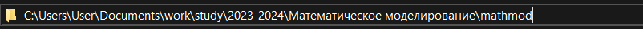

---
## Front matter
title: "Отчет по лабораторной работе №1"
subtitle: "Настройка рабочего пространства. Система контроля версий Git. Язык разметки Markdown."
author: "Желдакова Виктория Алексеевна"

## Generic otions
lang: ru-RU
toc-title: "Содержание"

## Bibliography
bibliography: bib/cite.bib
csl: pandoc/csl/gost-r-7-0-5-2008-numeric.csl

## Pdf output format
toc: true # Table of contents
toc-depth: 2
lof: true # List of figures
lot: true # List of tables
fontsize: 12pt
linestretch: 1.5
papersize: a4
documentclass: scrreprt
## I18n polyglossia
polyglossia-lang:
  name: russian
  options:
	- spelling=modern
	- babelshorthands=true
polyglossia-otherlangs:
  name: english
## I18n babel
babel-lang: russian
babel-otherlangs: english
## Fonts
mainfont: PT Serif
romanfont: PT Serif
sansfont: PT Sans
monofont: PT Mono
mainfontoptions: Ligatures=TeX
romanfontoptions: Ligatures=TeX
sansfontoptions: Ligatures=TeX,Scale=MatchLowercase
monofontoptions: Scale=MatchLowercase,Scale=0.9
## Biblatex
biblatex: true
biblio-style: "gost-numeric"
biblatexoptions:
  - parentracker=true
  - backend=biber
  - hyperref=auto
  - language=auto
  - autolang=other*
  - citestyle=gost-numeric
## Pandoc-crossref LaTeX customization
figureTitle: "Рис."
tableTitle: "Таблица"
listingTitle: "Листинг"
lofTitle: "Список иллюстраций"
lotTitle: "Список таблиц"
lolTitle: "Листинги"
## Misc options
indent: true
header-includes:
  - \usepackage{indentfirst}
  - \usepackage{float} # keep figures where there are in the text
  - \floatplacement{figure}{H} # keep figures where there are in the text
---

# Цель работы

Настройка рабочего пространства для лабораторных работ. Практическое использование системы контроля версий Git и языка разметки Markdown.

# Задание

Создать и настроить репозиторий курса на основе шаблона. Установить связь между компьютером и Github с помощью SSH-ключа. Сконвертировать отчет из расширения .md в .docx и .pdf. Сконвертировать презентацию из расширения .md в .html и .pdf.

# Теоретическое введение

Git — абсолютный лидер по популярности среди современных систем управления версиями. Это развитый проект с активной поддержкой и открытым исходным кодом. Система Git была изначально разработана в 2005 году Линусом Торвальдсом — создателем ядра операционной системы Linux. Git применяется для управления версиями в рамках колоссального количества проектов по разработке ПО, как коммерческих, так и с открытым исходным кодом.

Markdown — облегчённый язык разметки, созданный с целью обозначения форматирования в простом тексте, с максимальным сохранением его читаемости человеком, и пригодный для машинного преобразования в языки для продвинутых публикаций.

| Команда | Описание команды                                                                                                          |
|--------------|----------------------------------------------------------------------------------------------------------------------------|
| `init`          | Создает репозиторий в текущем каталоге                                                                 |
| `status `      | Показывает состояния файлов в рабочем каталоге и индексе     |
| `commit`       | Берёт все данные, добавленные в индекс с помощью git add, и сохраняет их слепок во внутренней базе данных, а затем сдвигает указатель текущей ветки на этот слепок.         |
| `add`      | Добавляет содержимое рабочего каталога в индекс (staging area) для последующего коммита |
| `push`     | Используется для установления связи с удалённым репозиторием, вычисления локальных изменений отсутствующих в нём, и собственно их передачи в вышеупомянутый репозиторий                                         |

# Выполнение лабораторной работы

Создаём каталог по приведённому шаблону (рис. [-@fig:001]).

{#fig:001 width=70%}

Копируем шаблон репозитория (рис. [-@fig:002]).

{#fig:002 width=70%}

Устанавливаем менеджер пакетов Chocolatey (рис. [-@fig:003]).

{#fig:003 width=70%}

Устанавливаем make и проверяем работоспособность (рис. [-@fig:004]).

{#fig:004 width=70%}

Устанавливаем Git (рис. [-@fig:005]).

{#fig:005 width=70%}

Генерируем SSH-ключ (рис. [-@fig:006]).

{#fig:006 width=70%}

Настройка агента и добавление ключа (рис. [-@fig:007]).

{#fig:007 width=70%}

Добавляем SSH-ключ в профиль Github (рис. [-@fig:008]).

{#fig:008 width=70%}

Клонируем репозиторий на компьютер (рис. [-@fig:009]).

{#fig:009 width=70%}

Устанавливаем pandoc для конвертирования файлов (рис. [-@fig:010]).

{#fig:010 width=70%}

Устанавливаем pandoc-crossref (рис. [-@fig:011]).

{#fig:011 width=70%}

Конвертируем отчет в docx и pdf(рис. [-@fig:012]).

{#fig:012 width=70%}

Получаем отчет в формате docx (рис. [-@fig:013]).

{#fig:013 width=70%}

Получаем отчет в формате pdf (рис. [-@fig:014]).

{#fig:014 width=70%}

Конвертируем презентацию и получаем её в формате pdf (рис. [-@fig:015]).

{#fig:015 width=70%}

Получаем презентацию в формате html (рис. [-@fig:016]).

{#fig:016 width=70%}

# Выводы

Настроили рабочее пространство для лабораторных работ и попрактиковались с системой контроля версий Git и языком разметки Markdown.

# Список литературы{.unnumbered}

- Документация по Git: https://git-scm.com/docs/user-manual
- Документация по Markdown: https://www.markdownguide.org/

