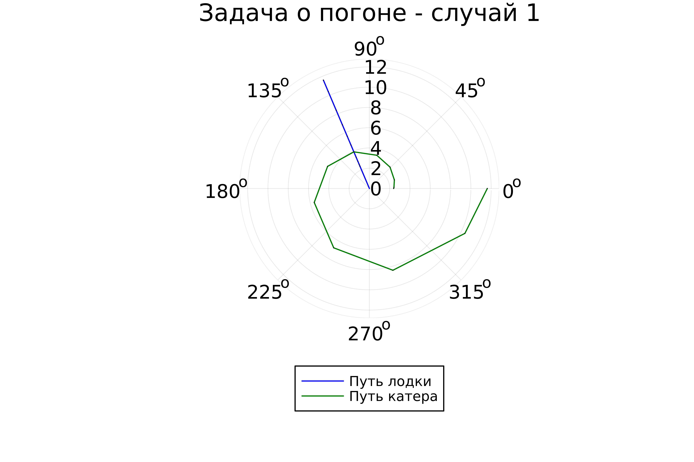
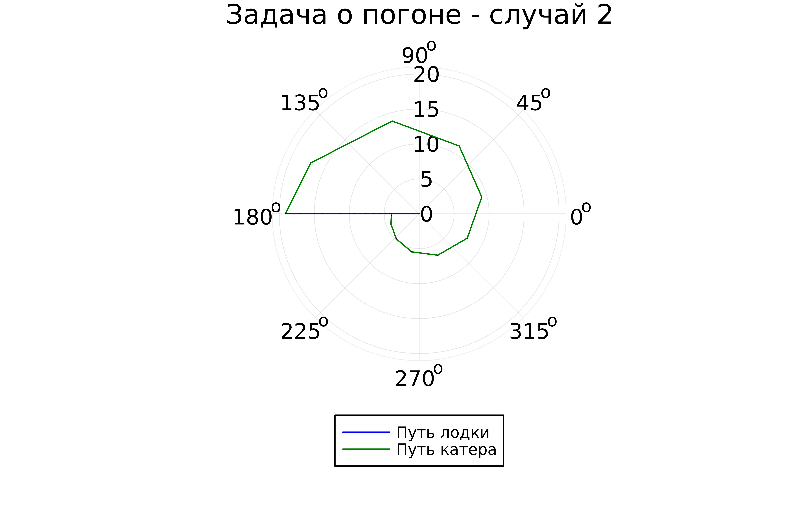

---
## Front matter
lang: ru-RU
title: Лабораторная работа №2
subtitle: Задача о погоне
author:
  - Желдакова В. А.
institute:
  - Российский университет дружбы народов, Москва, Россия
date: 17 февраля 2024

## i18n babel
babel-lang: russian
babel-otherlangs: english

## Formatting pdf
toc: false
toc-title: Содержание
slide_level: 2
aspectratio: 169
section-titles: true
theme: metropolis
header-includes:
 - \metroset{progressbar=frametitle,sectionpage=progressbar,numbering=fraction}
 - '\makeatletter'
 - '\beamer@ignorenonframefalse'
 - '\makeatother'
---

# Информация

## Докладчик

:::::::::::::: {.columns align=center}
::: {.column width="70%"}

  * Желдакова Виктория Алексеевна
  * студентка группы НФИбд-01-21
  * Российский университет дружбы народов

:::
::: {.column width="30%"}

:::
::::::::::::::

# Вводная часть

## Цель работы

- Изучить основы языков Julia и OpenModelica. 
- Познакомиться с библиотеками Plots и DifferentialEquations для построения графиков и решения дифференциальных уравнений.
- Решить задачу о погоне с использованием обоих языков.

## Справка о языках программирования

Julia — высокоуровневый свободный язык программирования с динамической типизацией, созданный для математических вычислений. Эффективен также и для написания программ общего назначения. Julia написан на Си, C++ и Scheme. Имеет встроенную поддержку многопоточности и распределённых вычислений, реализованные в том числе в стандартных конструкциях.

OpenModelica — свободное открытое программное обеспечение для моделирования, симуляции, оптимизации и анализа сложных динамических систем. OpenModelica используется в академической среде и на производстве. В промышленности используется в области оптимизации энергоснабжения,автомобилестроении и водоочистке.

## Задание

### Вариант 16

На море в тумане катер береговой охраны преследует лодку браконьеров.
Через определенный промежуток времени туман рассеивается, и лодка
обнаруживается на расстоянии 9,5 км от катера. Затем лодка снова скрывается в
тумане и уходит прямолинейно в неизвестном направлении. Известно, что скорость
катера в 3,3 раза больше скорости браконьерской лодки.

1. Запишите уравнение, описывающее движение катера, с начальными
условиями для двух случаев (в зависимости от расположения катера
относительно лодки в начальный момент времени).
2. Постройте траекторию движения катера и лодки для двух случаев.
3. Найдите точку пересечения траектории катера и лодки 

# Ход работы

## Математическая модель

Согласно варианту расстояние между лодкой и катером равно 9,5 км, а отношение скорости катера в 3,3 раза больше скорости браконьерской лодки. 

Введём полярные координаты с центром в точке нахождения браконьеров и осью, проходящей через катер береговой охраны. Чтобы найти расстояние x (расстояние после которого катер начнет двигаться вокруг полюса), необходимо составить простое уравнение. За это время лодка пройдет $x$, а катер $9,5 + x$. Время, за которое они пройдут это расстояние, вычисляется как $\frac{x}{v}$ или $\frac{9,5 - x}{3,3v}$ (во втором случае $\frac{9,5 + x}{3,3v}$). Так как время одно и то же, то эти величины одинаковы. Мы получаем объединение из двух уравнений для двух различных  начальных положений катера:

$$ \left[ \begin{array}{cl}
  \frac{x}{v} = \frac{9,5 - x}{3,3v}\\
  \frac{x}{v} = \frac{9,5 + x}{3,3v}
\end{array} \right. $$

## Математическая модель

Из данных уравнений можно найти расстояние, после которого катер начнёт раскручиваться по спирали. Для данных уравнений решения будут следующими: $x_1 = {\frac{95}{43}}$, $x_2 = {\frac{95}{23}}$. Задачу будем решать для двух случаев. После того, как катер береговой охраны окажется на одном расстоянии от полюса, что и лодка, он должен сменить прямолинейную траекторию и начать двигаться вокруг полюса удаляясь от него со скоростью лодки v. Для этого скорость катера раскладываем на две составляющие: $v_r = {\frac{dr}{dt}} = v$ - радиальная скорость и $v_\tau = r{\frac{d\theta}{dt}}$ - тангенциальная скорость.

Решение исходной задачи сводится к решению системы из двух дифференциальных уравнений:

$$ \left\{ \begin{array}{cl}
{\frac{dr}{dt}} = v \\
r{\frac{d\theta}{dt}} = {\sqrt{8925}v}
\end{array} \right. $$

## Математическая модель

с начальными условиями 

$$ \left\{ \begin{array}{cl}
\theta_0 = 0 \\
r_0 = x_1 = {\frac{95}{43}}
\end{array} \right. $$

$$ \left\{ \begin{array}{cl}
\theta_0 = -\pi \\
r_0 = x_2 = {\frac{95}{23}}
\end{array} \right. $$

Исключая из полученной системы производную по t, можно перейти к следующему уравнению (с неизменными начальными условиями):

$$ {\frac{dr}{d\theta}} = {\frac{r}{\sqrt{8925}}} $$

## Решение с помощью языков программирования

### OpenModelica

Реализация решения данной задачи невозможна с помощью OpenModelica, т.к. в ней не поддерживаются полярные координаты.

### Julia

Установим Julia и пакеты Plots и  DifferentialEquations для создания графиков и решения лифференциальных уравнений соответственно и проверим их установку.

В результате работы программы получаем графики для обоих случаев начального положения катера относительно полюса.

## Решение с помощью языков программирования

{#fig:004 width=70%}

## Решение с помощью языков программирования

{#fig:005 width=70%}

# Выводы

Изучила основы языков Julia и OpenModelica. Познакомилась с библиотеками Plots и DifferentialEquations для построения графиков и решения дифференциальных уравнений.
Решила задачу о погоне только с использованием языка Julia, т.к. OpenModelica не поддерживает работу с полярными координатами.

:::

