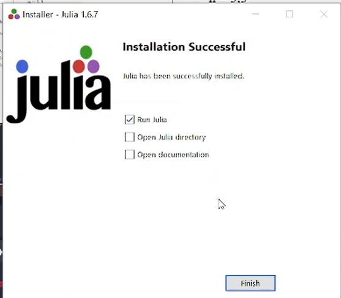
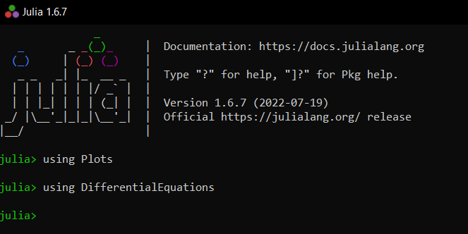
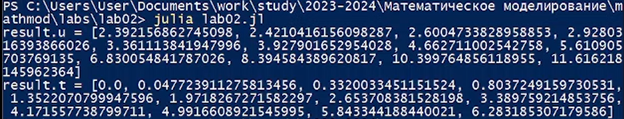
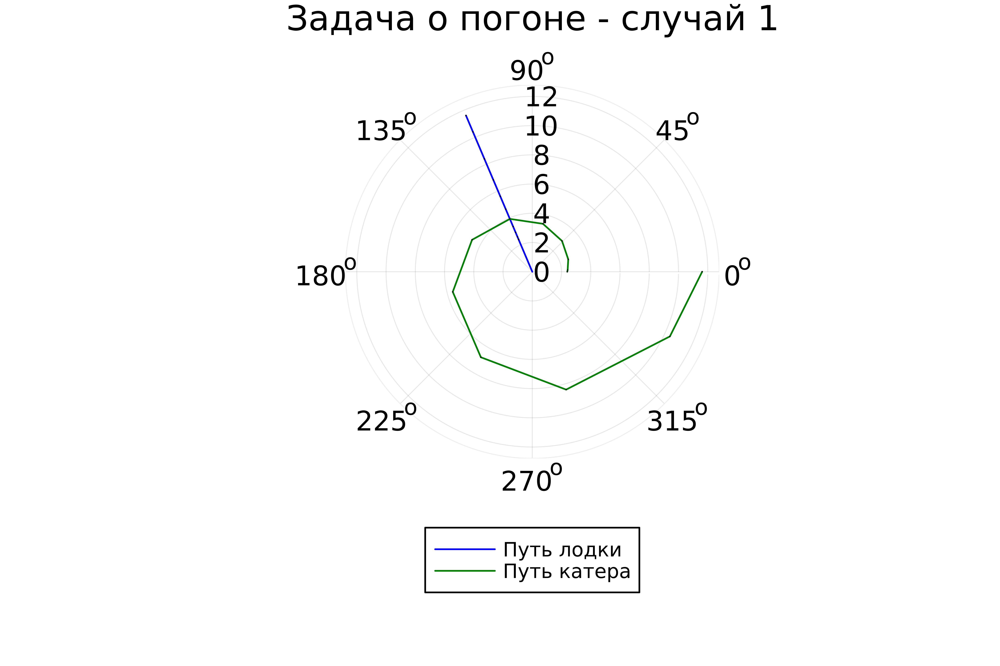
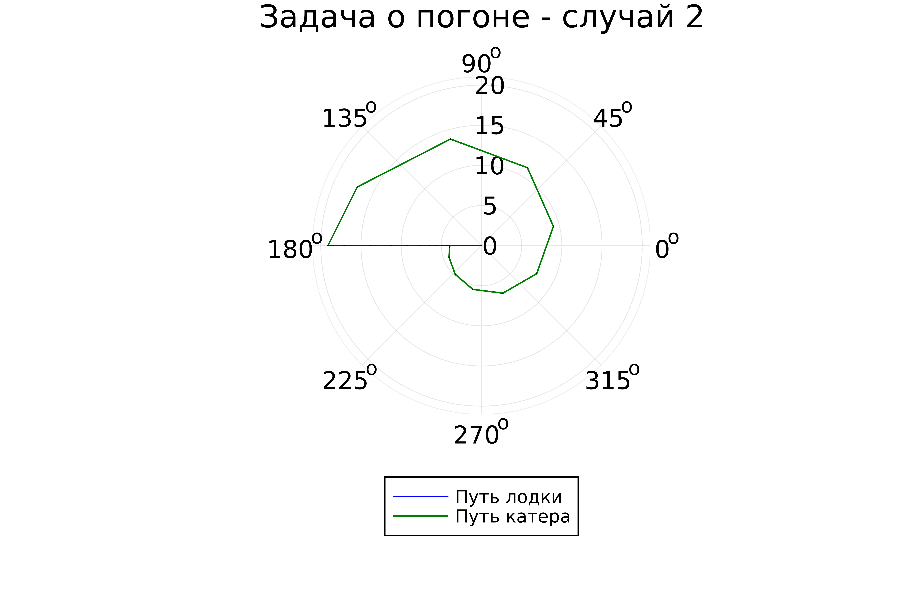

---
## Front matter
title: "Отчёт по лабораторной работе №2"
subtitle: "Задача о погоне"
author: "Желдакова Виктория Алексеевна"

## Generic otions
lang: ru-RU
toc-title: "Содержание"

## Bibliography
bibliography: bib/cite.bib
csl: pandoc/csl/gost-r-7-0-5-2008-numeric.csl

## Pdf output format
toc: true # Table of contents
toc-depth: 2
lof: true # List of figures
lot: true # List of tables
fontsize: 12pt
linestretch: 1.5
papersize: a4
documentclass: scrreprt
## I18n polyglossia
polyglossia-lang:
  name: russian
  options:
	- spelling=modern
	- babelshorthands=true
polyglossia-otherlangs:
  name: english
## I18n babel
babel-lang: russian
babel-otherlangs: english
## Fonts
mainfont: PT Serif
romanfont: PT Serif
sansfont: PT Sans
monofont: PT Mono
mainfontoptions: Ligatures=TeX
romanfontoptions: Ligatures=TeX
sansfontoptions: Ligatures=TeX,Scale=MatchLowercase
monofontoptions: Scale=MatchLowercase,Scale=0.9
## Biblatex
biblatex: true
biblio-style: "gost-numeric"
biblatexoptions:
  - parentracker=true
  - backend=biber
  - hyperref=auto
  - language=auto
  - autolang=other*
  - citestyle=gost-numeric
## Pandoc-crossref LaTeX customization
figureTitle: "Рис."
tableTitle: "Таблица"
listingTitle: "Листинг"
lofTitle: "Список иллюстраций"
lotTitle: "Список таблиц"
lolTitle: "Листинги"
## Misc options
indent: true
header-includes:
  - \usepackage{indentfirst}
  - \usepackage{float} # keep figures where there are in the text
  - \floatplacement{figure}{H} # keep figures where there are in the text
---

# Цель работы

Изучить основы языков Julia и OpenModelica. Познакомиться с библиотеками Plots и DifferentialEquations для построения графиков и решения дифференциальных уравнений.
Решить задачу о погоне с использованием обоих языков.

# Задание

## Вариант 16

На море в тумане катер береговой охраны преследует лодку браконьеров.
Через определенный промежуток времени туман рассеивается, и лодка
обнаруживается на расстоянии 9,5 км от катера. Затем лодка снова скрывается в
тумане и уходит прямолинейно в неизвестном направлении. Известно, что скорость
катера в 3,3 раза больше скорости браконьерской лодки.

1. Запишите уравнение, описывающее движение катера, с начальными
условиями для двух случаев (в зависимости от расположения катера
относительно лодки в начальный момент времени).
2. Постройте траекторию движения катера и лодки для двух случаев.
3. Найдите точку пересечения траектории катера и лодки 

# Теоретическое введение

## Справка о языках программирования

Julia — высокоуровневый свободный язык программирования с динамической типизацией, созданный для математических вычислений. Эффективен также и для написания программ общего назначения. Синтаксис языка схож с синтаксисом других математических языков (например, MATLAB и Octave), однако имеет некоторые существенные отличия. Julia написан на Си, C++ и Scheme. Имеет встроенную поддержку многопоточности и распределённых вычислений, реализованные в том числе в стандартных конструкциях.

OpenModelica — свободное открытое программное обеспечение для моделирования, симуляции, оптимизации и анализа сложных динамических систем. Основано на языке Modelica. Активно развивается Open Source Modelica Consortium, некоммерческой неправительственной организацией. Open Source Modelica Consortium является совместным проектом RISE SICS East AB и Линчёпингского университета. OpenModelica используется в академической среде и на производстве. В промышленности используется в области оптимизации энергоснабжения,автомобилестроении и водоочистке.

## Математическая справка

Дифференциальное уравнение — уравнение, которое помимо функции содержит её производные. Порядок входящих в уравнение производных может быть различен (формально он ничем не ограничен). Производные, функции, независимые переменные и параметры могут входить в уравнение в различных комбинациях или отсутствовать вовсе, кроме хотя бы одной производной. Не любое уравнение, содержащее производные неизвестной функции, является дифференциальным.

Дифференциальные уравнения являются частным случаем функциональных уравнений. В отличие от алгебраических уравнений, в результате решения которых ищется число (несколько чисел), при решении дифференциальных уравнений ищется функция (семейство функций).

# Выполнение лабораторной работы

## Математическая модель

Согласно варианту расстояние между лодкой и катером равно 9,5 км, а отношение скорости катера в 3,3 раза больше скорости браконьерской лодки. 

Введём полярные координаты с центром в точке нахождения браконьеров и осью, проходящей через катер береговой охраны. Траектория катера должна быть такой, чтобы и катер, и лодка все время
были на одном расстоянии от полюса, только в этом случае траектория
катера пересечется с траекторией лодки. 

Поэтому для начала катер береговой охраны должен двигаться некоторое
время прямолинейно, пока не окажется на том же расстоянии от полюса, что
и лодка браконьеров. После этого катер береговой охраны должен двигаться
вокруг полюса удаляясь от него с той же скоростью, что и лодка
браконьеров.

Чтобы найти расстояние x (расстояние после которого катер начнет двигаться вокруг полюса), необходимо составить простое уравнение. Пусть через время t катер и лодка окажутся на одном расстоянии x от полюса. За это время лодка пройдет $x$, а катер $9,5 + x$ (или $9,5 - x$, в зависимости от
начального положения катера относительно полюса). Время, за которое они
пройдут это расстояние, вычисляется как $\frac{x}{v}$ или $\frac{9,5 - x}{3,3v}$ (во втором случае $\frac{9,5 + x}{3,3v}$). Так как время одно и то же, то эти величины одинаковы. Мы получаем объединение из двух уравнений для двух различных  начальных положений катера:

$$ \left[ \begin{array}{cl}
  \frac{x}{v} = \frac{9,5 - x}{3,3v}\\
  \frac{x}{v} = \frac{9,5 + x}{3,3v}
\end{array} \right. $$

Из данных уравнений можно найти расстояние, после которого катер начнёт раскручиваться по спирали. Для данных уравнений решения будут следующими: $x_1 = {\frac{95}{43}}$, $x_2 = {\frac{95}{23}}$. Задачу будем решать для двух случаев. После того, как катер береговой охраны окажется на одном расстоянии от полюса, что и лодка, он должен сменить прямолинейную траекторию и начать двигаться вокруг полюса удаляясь от него со скоростью лодки v. Для этого скорость катера раскладываем на две составляющие: $v_r = {\frac{dr}{dt}} = v$ - радиальная скорость и $v_\tau = r{\frac{d\theta}{dt}}$ - тангенциальная скорость.

4. Решение исходной задачи сводится к решению системы из двух дифференциальных уравнений:

$$ \left\{ \begin{array}{cl}
{\frac{dr}{dt}} = v \\
r{\frac{d\theta}{dt}} = {\sqrt{8925}v}
\end{array} \right. $$

с начальными условиями 

$$ \left\{ \begin{array}{cl}
\theta_0 = 0 \\
r_0 = x_1 = {\frac{95}{43}}
\end{array} \right. $$

или

$$ \left\{ \begin{array}{cl}
\theta_0 = -\pi \\
r_0 = x_2 = {\frac{95}{23}}
\end{array} \right. $$

Исключая из полученной системы производную по t, можно перейти к следующему уравнению (с неизменными начальными условиями):

$$ {\frac{dr}{d\theta}} = {\frac{r}{\sqrt{8925}}} $$

Решением этого уравнения с заданными начальными условиями и будет являться траектория движения катера в полярных координатах.

## Решение с помощью языков программирования

### OpenModelica

Реализация решения данной задачи невозможна с помощью OpenModelica, т.к. в ней не поддерживаются полярные координаты. [1]

### Julia

Установим Julia (рис. [-@fig:001]).

{#fig:001 width=70%}

Установим пакеты Plots и  DifferentialEquations для создания графиков и решения лифференциальных уравнений соответственно и проверим их установку (рис. [-@fig:002]). [2]

{#fig:002 width=70%}

Напишем программу для решения нашей задачи. Код программы:

```
using Plots
using DifferentialEquations

const k = 12.2
const n = 4.1

const r0 = k/(n + 1)
const r02 = k/(n - 1)

const T = (0, 2*pi)
const T2 = (-pi, pi)

function F(u, p, t)
    return u / sqrt(n*n - 1)
end

problem = ODEProblem(F, r0, T) 
result = solve(problem, abstol=1e-8, reltol=1e-8)
@show result.u
@show result.t

dxR = rand(1:size(result.t)[1])
rAngles = [result.t[dxR] for i in 1:size(result.t)[1]]

plt = plot(proj=:polar, aspect_ratio=:equal, dpi = 1000, legend=true, bg=:white)

plot!(plt, xlabel="theta", ylabel="r(t)", title="Задача о погоне - случай 1", legend=:outerbottom)
plot!(plt, [rAngles[1], rAngles[2]], [0.0, result.u[size(result.u)[1]]], label="Путь лодки", color=:blue, lw=1)
scatter!(plt, rAngles, result.u, label="", mc=:blue, ms=0.0005)
plot!(plt, result.t, result.u, xlabel="theta", ylabel="r(t)", label="Путь катера", color=:green, lw=1)
scatter!(plt, result.t, result.u, label="", mc=:green, ms=0.0005)

savefig(plt, "lab02_01.png")

problem = ODEProblem(F, r02 , T2)
result = solve(problem, abstol=1e-8, reltol=1e-8)
dxR = rand(1:size(result.t)[1])
rAngles = [result.t[dxR] for i in 1:size(result.t)[1]]

plt1 = plot(proj=:polar, aspect_ratio=:equal, dpi = 1000, legend=true, bg=:white)

plot!(plt1, xlabel="theta", ylabel="r(t)", title="Задача о погоне - случай 2", legend=:outerbottom)
plot!(plt1, [rAngles[1], rAngles[2]], [0.0, result.u[size(result.u)[1]]], label="Путь лодки", color=:blue, lw=1)
scatter!(plt1, rAngles, result.u, label="", mc=:blue, ms=0.0005)
plot!(plt1, result.t, result.u, xlabel="theta", ylabel="r(t)", label="Путь катера", color=:green, lw=1)
scatter!(plt1, result.t, result.u, label="", mc=:green, ms=0.0005)

savefig(plt1, "lab02_02.png")
```
Запустим программу (рис. [-@fig:003]).

{#fig:003 width=70%}

В результате работы программы получаем графики для обоих случаев начального положения катера относительно полюса (рис. [-@fig:004]) (рис. [-@fig:005]).

{#fig:004 width=70%}

{#fig:005 width=70%}

# Выводы

Изучила основы языков Julia и OpenModelica. Познакомилась с библиотеками Plots и DifferentialEquations для построения графиков и решения дифференциальных уравнений.
Решила задачу о погоне только с использованием языка Julia, т.к. OpenModelica не поддерживает работу с полярными координатами.

# Список литературы{.unnumbered}

[1] Документация по OpenModelica: https://openmodelica.org/

[2] Документация по Julia: https://docs.julialang.org/en/v1/
