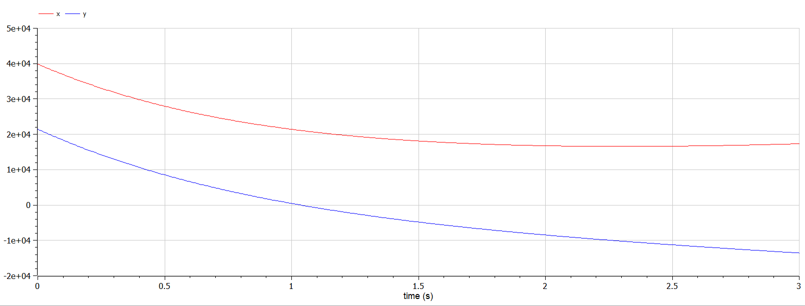

---
## Front matter
lang: ru-RU
title: Лабораторная работа №3
subtitle: Модель боевых действий
author:
  - Желдакова В. А.
institute:
  - Российский университет дружбы народов, Москва, Россия
date: 20 февраля 2024

## i18n babel
babel-lang: russian
babel-otherlangs: english

## Formatting pdf
toc: false
toc-title: Содержание
slide_level: 2
aspectratio: 169
section-titles: true
theme: metropolis
header-includes:
 - \metroset{progressbar=frametitle,sectionpage=progressbar,numbering=fraction}
 - '\makeatletter'
 - '\beamer@ignorenonframefalse'
 - '\makeatother'
---

# Информация

## Докладчик

:::::::::::::: {.columns align=center}
::: {.column width="70%"}

  * Желдакова Виктория Алексеевна
  * студентка группы НФИбд-01-21
  * Российский университет дружбы народов

:::
::: {.column width="30%"}

:::
::::::::::::::

# Вводная часть

## Цель работы

Построить графики изменения численности войск армии Х и армии У для модели боевых действий между регулярными войсками и боевых действий между регулярными войсками и партизанскими отрядами с помощью языков OpenModelica и Julia.

## Задание

### Вариант 16

Между страной Х и страной У идет война. Численность состава войскисчисляется от начала войны, и являются временными функциями $x(t)$ и $y(t)$. В начальный момент времени страна Х имеет армию численностью 39800 человек, а в распоряжении страны У армия численностью в 21400 человек. Для упрощения модели считаем, что коэффициенты $a, b, c, h$ постоянны. Также считаем $P(t)$ и $Q(t)$ непрерывные функции.

Постройте графики изменения численности войск армии Х и армии У для
следующих случаев:
1. Модель боевых действий между регулярными войсками
$$ \begin{array}{cl}
  {\frac{dx}{dt}} = -0,42x(t) - 0,68y(t) + sin(5t+1)\\
  {\frac{dy}{dt}} = -0,59x(t) - 0,43y(t) + cos(5t+2)
\end{array} $$

## Задание

2. Модель ведение боевых действий с участием регулярных войск и
партизанских отрядов 
$$ \begin{array}{cl}
{\frac{dx}{dt}} = -0,301x(t) - 0,7y(t) + sin(20t) + 1\\
{\frac{dy}{dt}} = -0,502x(t)y(t) - 0,4y(t) + cos(20t) + 1
\end{array} $$

# Ход работы

## Математическая модель

Рассмотрим два случая ведения боевых действий:
1. Боевые действия между регулярными войсками
2. Боевые действия с участием регулярных войск и партизанских отрядов

В первом случае численность регулярных войск определяется тремя факторами:
- скорость уменьшения численности войск из-за причин, не связанных с боевыми действиями (болезни, травмы, дезертирство);
- скорость потерь, обусловленных боевыми действиями противоборствующих сторон (что связанно с качеством стратегии, уровнем вооружения, профессионализмом солдат и т.п.);
- скорость поступления подкрепления (задаётся некоторой функцией от времени).

В этом случае модель боевых действий между регулярными войсками описывается следующим образом
$$ \begin{array}{cl}
{\frac{dx}{dt}} = -a(t)x(t) - b(t)y(t) + P(t)\\
{\frac{dy}{dt}} = -c(t)x(t) - h(t)y(t) + Q(t)
\end{array} $$

## Математическая модель

Во втором случае в борьбу добавляются партизанские отряды. Нерегулярные войска в отличии от постоянной армии менее уязвимы, так как действуют скрытно, в этом случае сопернику приходится действовать неизбирательно, по площадям, занимаемым партизанами. Поэтому считается, что тем потерь партизан, проводящих свои операции в разных местах на некоторой известной территории, пропорционален не только численности армейских соединений, но и численности самих партизан. В результате модель принимает вид:

$$ \begin{array}{cl}
  {\frac{dx}{dt}} = -a(t)x(t) - b(t)y(t) + P(t)\\
  {\frac{dy}{dt}} = -c(t)x(t)y(t) - h(t)y(t) + Q(t)
\end{array} $$

## Решение с помощью языков программирования

### OpenModelica

{#fig:002 width=70%}

## Решение с помощью языков программирования

{#fig:003 width=70%}

## Решение с помощью языков программирования

### Julia

{#fig:004 width=70%}

## Решение с помощью языков программирования

{#fig:005 width=70%}

## Анализ

Графики в OpenModelica получились идентичными с графиками, полученными с помощью Julia. 

# Выводы

Построили графики изменения численности войск армии Х и армии У для модели боевых действий между регулярными войсками и боевых действий между регулярными войсками и партизанскими отрядами с помощью языков OpenModelica и Julia.

:::

