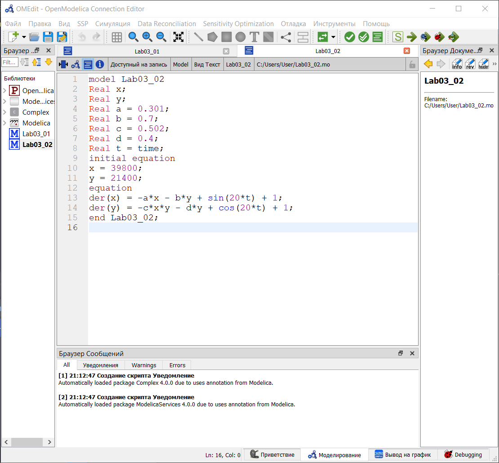
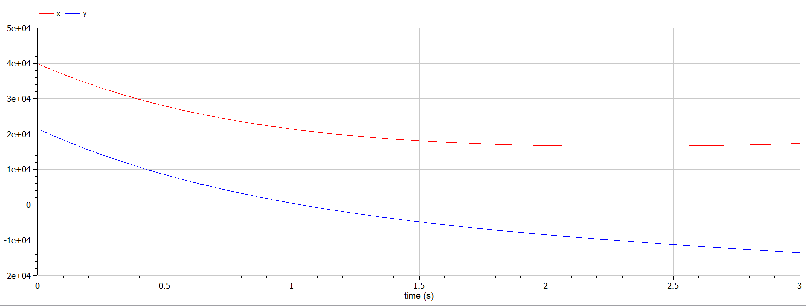
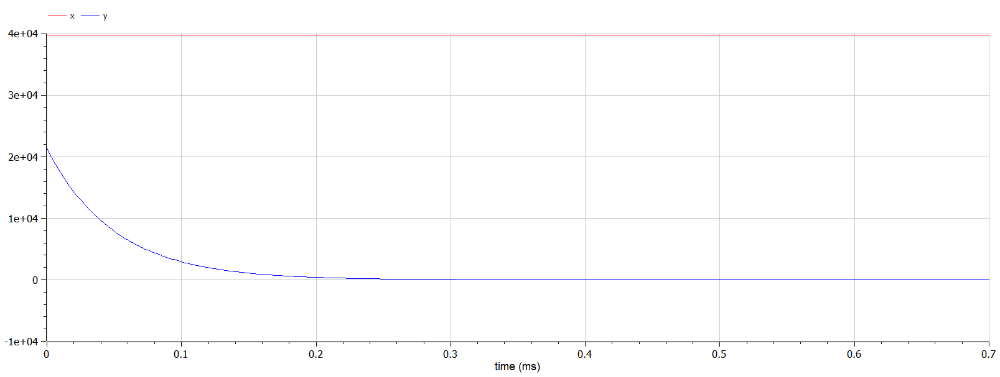
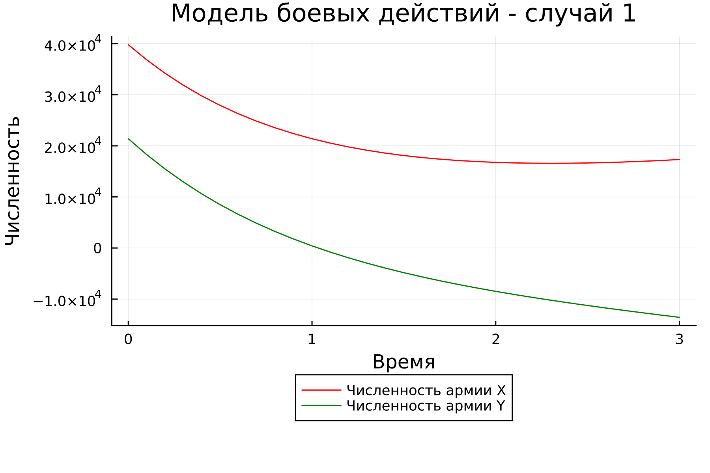
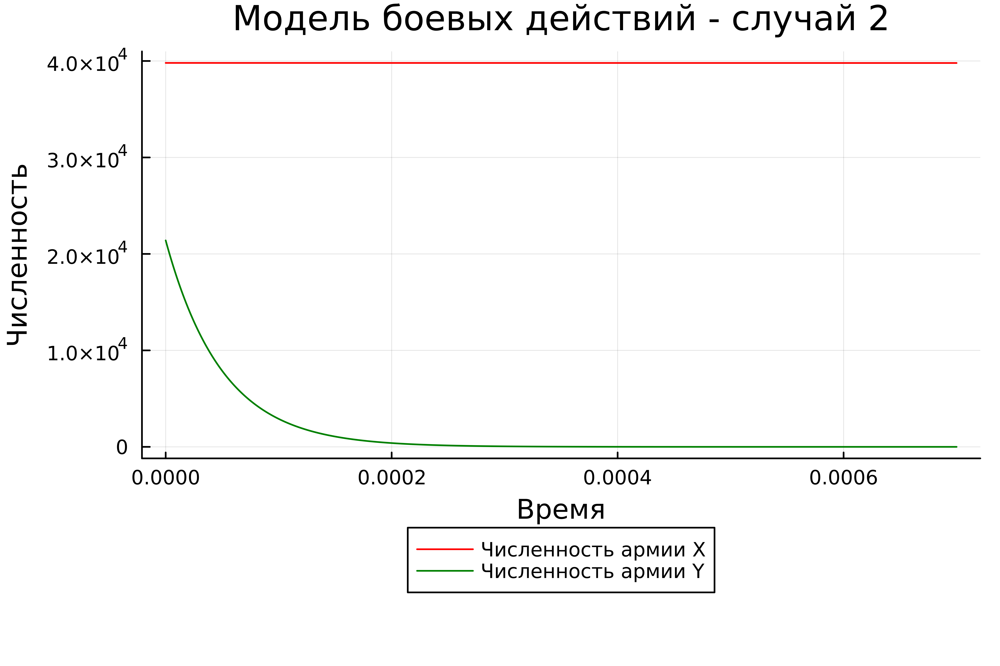

---
## Front matter
title: "Отчёт по лабораторной работе №3"
subtitle: "Модель боевых действий"
author: "Желдакова Виктория Алексеевна"

## Generic otions
lang: ru-RU
toc-title: "Содержание"

## Bibliography
bibliography: bib/cite.bib
csl: pandoc/csl/gost-r-7-0-5-2008-numeric.csl

## Pdf output format
toc: true # Table of contents
toc-depth: 2
lof: true # List of figures
lot: true # List of tables
fontsize: 12pt
linestretch: 1.5
papersize: a4
documentclass: scrreprt
## I18n polyglossia
polyglossia-lang:
  name: russian
  options:
	- spelling=modern
	- babelshorthands=true
polyglossia-otherlangs:
  name: english
## I18n babel
babel-lang: russian
babel-otherlangs: english
## Fonts
mainfont: PT Serif
romanfont: PT Serif
sansfont: PT Sans
monofont: PT Mono
mainfontoptions: Ligatures=TeX
romanfontoptions: Ligatures=TeX
sansfontoptions: Ligatures=TeX,Scale=MatchLowercase
monofontoptions: Scale=MatchLowercase,Scale=0.9
## Biblatex
biblatex: true
biblio-style: "gost-numeric"
biblatexoptions:
  - parentracker=true
  - backend=biber
  - hyperref=auto
  - language=auto
  - autolang=other*
  - citestyle=gost-numeric
## Pandoc-crossref LaTeX customization
figureTitle: "Рис."
tableTitle: "Таблица"
listingTitle: "Листинг"
lofTitle: "Список иллюстраций"
lotTitle: "Список таблиц"
lolTitle: "Листинги"
## Misc options
indent: true
header-includes:
  - \usepackage{indentfirst}
  - \usepackage{float} # keep figures where there are in the text
  - \floatplacement{figure}{H} # keep figures where there are in the text
---

# Цель работы

Построить графики изменения численности войск армии Х и армии У для модели боевых действий между регулярными войсками и боевых действий между регулярными войсками и партизанскими отрядами с помощью языков OpenModelica и Julia.

# Задание

## Вариант 16

Между страной Х и страной У идет война. Численность состава войскисчисляется от начала войны, и являются временными функциями $x(t)$ и $y(t)$. В начальный момент времени страна Х имеет армию численностью 39800 человек, а в распоряжении страны У армия численностью в 21400 человек. Для упрощения модели считаем, что коэффициенты $a, b, c, h$ постоянны. Также считаем $P(t)$ и $Q(t)$ непрерывные функции.

Постройте графики изменения численности войск армии Х и армии У для
следующих случаев:
1. Модель боевых действий между регулярными войсками
$$ \begin{array}{cl}
  {\frac{dx}{dt}} = -0,42x(t) - 0,68y(t) + sin(5t+1)\\
  {\frac{dy}{dt}} = -0,59x(t) - 0,43y(t) + cos(5t+2)
\end{array} $$
2. Модель ведение боевых действий с участием регулярных войск и
партизанских отрядов 
$$ \begin{array}{cl}
{\frac{dx}{dt}} = -0,301x(t) - 0,7y(t) + sin(20t) + 1\\
{\frac{dy}{dt}} = -0,502x(t)y(t) - 0,4y(t) + cos(20t) + 1
\end{array} $$

# Теоретическое введение

## Справка о языках программирования

Julia — высокоуровневый свободный язык программирования с динамической типизацией, созданный для математических вычислений. Эффективен также и для написания программ общего назначения. Синтаксис языка схож с синтаксисом других математических языков (например, MATLAB и Octave), однако имеет некоторые существенные отличия. Julia написан на Си, C++ и Scheme. Имеет встроенную поддержку многопоточности и распределённых вычислений, реализованные в том числе в стандартных конструкциях.

OpenModelica — свободное открытое программное обеспечение для моделирования, симуляции, оптимизации и анализа сложных динамических систем. Основано на языке Modelica. Активно развивается Open Source Modelica Consortium, некоммерческой неправительственной организацией. Open Source Modelica Consortium является совместным проектом RISE SICS East AB и Линчёпингского университета. OpenModelica используется в академической среде и на производстве. В промышленности используется в области оптимизации энергоснабжения,автомобилестроении и водоочистке.

## Математическая справка

Дифференциальное уравнение — уравнение, которое помимо функции содержит её производные. Порядок входящих в уравнение производных может быть различен (формально он ничем не ограничен). Производные, функции, независимые переменные и параметры могут входить в уравнение в различных комбинациях или отсутствовать вовсе, кроме хотя бы одной производной. Не любое уравнение, содержащее производные неизвестной функции, является дифференциальным.

Дифференциальные уравнения являются частным случаем функциональных уравнений. В отличие от алгебраических уравнений, в результате решения которых ищется число (несколько чисел), при решении дифференциальных уравнений ищется функция (семейство функций).

# Выполнение лабораторной работы

## Математическая модель

Рассмотрим два случая ведения боевых действий:
1. Боевые действия между регулярными войсками
2. Боевые действия с участием регулярных войск и партизанских отрядов

В первом случае численность регулярных войск определяется тремя факторами:
- скорость уменьшения численности войск из-за причин, не связанных с боевыми действиями (болезни, травмы, дезертирство);
- скорость потерь, обусловленных боевыми действиями противоборствующих сторон (что связанно с качеством стратегии, уровнем вооружения, профессионализмом солдат и т.п.);
- скорость поступления подкрепления (задаётся некоторой функцией от времени).

В этом случае модель боевых действий между регулярными войсками описывается следующим образом
$$ \begin{array}{cl}
{\frac{dx}{dt}} = -a(t)x(t) - b(t)y(t) + P(t)\\
{\frac{dy}{dt}} = -c(t)x(t) - h(t)y(t) + Q(t)
\end{array} $$

Потери, не связанные с боевыми действиями, описывают члены $-a(t)x(t)$ и $-h(t)y(t)$, члены $-b(t)y(t)$ и $-c(t)x(t)$ отражают потери на поле боя.Коэффициенты $b(t)$ и $c(t)$ указывают на эффективность боевых действий со стороны у и х соответственно, $a(t), h(t)$ - величины, характеризующие степень влияния различных факторов на потери. Функции $P(t), Q(t)$ учитывают возможность подхода подкрепления к войскам Х и У в течение одного дня. Во втором случае в борьбу добавляются партизанские отряды. Нерегулярные войска в отличии от постоянной армии менее уязвимы, так как действуют скрытно, в этом случае сопернику приходится действовать неизбирательно, по площадям, занимаемым партизанами. Поэтому считается, что тем потерь партизан, проводящих свои операции в разных местах на некоторой известной территории, пропорционален не только численности армейских соединений, но и численности самих партизан. В результате модель принимает вид:

$$ \begin{array}{cl}
  {\frac{dx}{dt}} = -a(t)x(t) - b(t)y(t) + P(t)\\
  {\frac{dy}{dt}} = -c(t)x(t)y(t) - h(t)y(t) + Q(t)
\end{array} $$

## Решение с помощью языков программирования

### OpenModelica

Установим OpenModelica (рис. [-@fig:001]).

{#fig:001 width=70%}

Напишем программу для решения первого случая нашей задачи. [1] Код программы:

```
model Lab03_01
Real x;
Real y;
Real a = 0.42;
Real b = 0.68;
Real c = 0.59;
Real d = 0.43;
Real t = time;
initial equation
x = 39800;
y = 21400;
equation
der(x) = -a*x - b*y + sin(5*t+1);
der(y) = -c*x - d*y + cos(5*t+2);
end Lab03_01;
```

Напишем программу для решения второго случая нашей задачи. Код программы:

```
model Lab03_02
Real x;
Real y;
Real a = 0.301;
Real b = 0.7;
Real c = 0.502;
Real d = 0.4;
Real t = time;
initial equation
x = 39800;
y = 21400;
equation
der(x) = -a*x - b*y + sin(20*t) + 1;
der(y) = -c*x*y - d*y + cos(20*t) + 1;
end Lab03_02;
```

В результате симулирования моделей получаем графики для обоих видов боевых действий (рис. [-@fig:002]) (рис. [-@fig:003]).

{#fig:002 width=70%}

{#fig:003 width=70%}

### Julia

Напишем программу для решения нашей задачи на Julia. [2] Код программы:

```
using Plots;
using DifferentialEquations;

function one(du, u, p, t)
    du[1] = - 0.42*u[1] - 0.68*u[2] + sin(5*t+1)
    du[2] = - 0.59*u[1] - 0.43*u[2] + cos(5*t+2)
end

function two(du, u, p, t)
    du[1] = - 0.301*u[1] - 0.7*u[2] + sin(20*t) + 1
    du[2] = (- 0.502*u[1] - 0.4)*u[2] + cos(20*t) + 1
end

const people = Float64[39800, 21400]
const prom1 = [0.0, 3.0]
const prom2 = [0.0, 0.0007]

prob1 = ODEProblem(one, people, prom1)
prob2 = ODEProblem(two, people, prom2)

sol1 = solve(prob1, dtmax=0.1)
sol2 = solve(prob2, dtmax=0.000001)

A1 = [u[1] for u in sol1.u]
A2 = [u[2] for u in sol1.u]
T1 = [t for t in sol1.t]
A3 = [u[1] for u in sol2.u]
A4 = [u[2] for u in sol2.u]
T2 = [t for t in sol2.t]

plt1 = plot(dpi = 300, legend= true, bg =:white)
plot!(plt1, xlabel="Время", ylabel="Численность", title="Модель боевых действий - случай 1", legend=:outerbottom)
plot!(plt1, T1, A1, label="Численность армии X", color =:red)
plot!(plt1, T1, A2, label="Численность армии Y", color =:green)
savefig(plt1, "lab03_1.png")

plt2 = plot(dpi = 1200, legend= true, bg =:white)
plot!(plt2, xlabel="Время", ylabel="Численность", title="Модель боевых действий - случай 2", legend=:outerbottom)
plot!(plt2, T2, A3, label="Численность армии X", color =:red)
plot!(plt2, T2, A4, label="Численность армии Y", color =:green)
savefig(plt2, "lab03_2.png")
```

В результате работы программы получаем графики для обоих видов боевых действий (рис. [-@fig:004]) (рис. [-@fig:005]).

{#fig:004 width=70%}

{#fig:005 width=70%}

## Анализ

Графики в OpenModelica получились идентичными с графиками, полученными с помощью Julia. 

# Выводы

Построили графики изменения численности войск армии Х и армии У для модели боевых действий между регулярными войсками и боевых действий между регулярными войсками и партизанскими отрядами с помощью языков OpenModelica и Julia.

# Список литературы{.unnumbered}

[1] Документация по OpenModelica: https://openmodelica.org/

[2] Документация по Julia: https://docs.julialang.org/en/v1/
