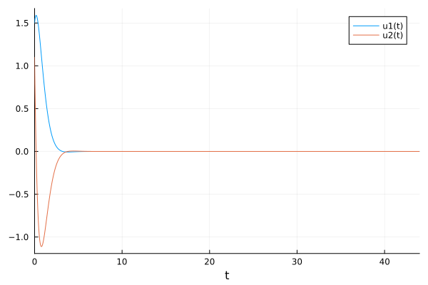

---
## Front matter
lang: ru-RU
title: Лабораторная работа №4
subtitle: Модель гармонических колебаний
author:
  - Желдакова В. А.
institute:
  - Российский университет дружбы народов, Москва, Россия
date: 25 февраля 2024

## i18n babel
babel-lang: russian
babel-otherlangs: english

## Formatting pdf
toc: false
toc-title: Содержание
slide_level: 2
aspectratio: 169
section-titles: true
theme: metropolis
header-includes:
 - \metroset{progressbar=frametitle,sectionpage=progressbar,numbering=fraction}
 - '\makeatletter'
 - '\beamer@ignorenonframefalse'
 - '\makeatother'
---

# Информация

## Докладчик

:::::::::::::: {.columns align=center}
::: {.column width="70%"}

  * Желдакова Виктория Алексеевна
  * студентка группы НФИбд-01-21
  * Российский университет дружбы народов

:::
::: {.column width="30%"}

:::
::::::::::::::

# Вводная часть

## Цель работы

Ознакомиться с понятием гармонического осциллятора. Построить фазовый портрет и решение уравнения гармонического осциллятора с помощью языков OpenModelica и Julia.

## Задание

### Вариант 16

Постройте фазовый портрет гармонического осциллятора и решение уравнения
гармонического осциллятора для следующих случаев:
1. Колебания гармонического осциллятора без затуханий и без действий внешней силы $\ddot{x}+2x=0$
2. Колебания гармонического осциллятора c затуханием и без действий внешней силы $\ddot{x}+3\dot{x}+3x=0$
3. Колебания гармонического осциллятора c затуханием и под действием внешней силы $\ddot{x}+4\dot{x}+4x=sin(4t)$

# Ход работы

## Математическая модель

Движение грузика на пружинке, маятника, заряда в электрическом контуре, а также эволюция во времени многих систем в физике, химии, биологии и других науках при определенных предположениях можно описать одним и тем же дифференциальным уравнением, которое в теории колебаний выступает в качестве основной модели. Эта модель называется линейным гармоническим осциллятором.

Уравнение свободных колебаний гармонического осциллятора имеет следующий вид:

$$\ddot{x}+2\gamma\dot{x}+\omega_0^2=0$$

где $x$ – переменная, описывающая состояние системы (смещение грузика,заряд конденсатора и т.д.), $\gamma$ – параметр, характеризующий потери энергии (трение в механической системе, сопротивление в контуре), $\omega_0$ - собственная частота колебаний, t – время.

## Математическая модель

При отсутствии потерь в системе вместо уравнения получаем уравнение консервативного осциллятора энергия колебания которого сохраняется во времени.

$$\ddot{x}+\omega_0^2x=0$$

Для однозначной разрешимости уравнения второго порядка необходимо задать два начальных условия вида

$$\left\{ \begin{array}{cl}
{x(t_0)=x_0}\\
{\dot{x}(t_0)=y_0}
\end{array} \right. $$

## Математическая модель

Уравнение второго порядка можно представить в виде системы двух
уравнений первого порядка

$$\left\{ \begin{array}{cl}
{\dot{x}=y}\\
{\dot{y}=-\omega_0^2x}
\end{array} \right. $$

Начальные условия для системы примут вид:

$$\left\{ \begin{array}{cl}
{x(t_0)=x_0}\\
{y(t_0)=y_0}
\end{array} \right. $$

Независимые переменные x, y определяют пространство, в котором «движется» решение. Это фазовое пространство системы, поскольку оно двумерно будем называть его фазовой плоскостью.

## Математическая модель

Значение фазовых координат x, y в любой момент времени полностью определяет состояние системы. Решению уравнения движения как функции времени отвечает гладкая кривая в фазовой плоскости. Она называется фазовой траекторией. Если множество различных решений (соответствующих различным начальным условиям) изобразить на одной фазовой плоскости, возникает общая картина поведения системы. Такую картину, образованную набором фазовых траекторий, называют фазовым портретом

## Решение с помощью языков программирования

### OpenModelica

В результате работы программы для первого случая получаем следующие графики:

{#fig:007 width=70%}

## Решение с помощью языков программирования

{#fig:008 width=70%}

## Решение с помощью языков программирования

В результате работы программы для второго случая получаем следующие графики:

{#fig:009 width=70%}

## Решение с помощью языков программирования

{#fig:010 width=70%}

## Решение с помощью языков программирования

В результате работы программы для третьего случая получаем следующие графики:

{#fig:011 width=70%}

## Решение с помощью языков программирования

{#fig:012 width=70%}

### Julia

В результате работы программы для первого случая получаем следующие графики:

{#fig:001 width=70%}

## Решение с помощью языков программирования

{#fig:002 width=70%}

## Решение с помощью языков программирования

В результате работы программы для второго случая получаем следующие графики:

{#fig:003 width=70%}

## Решение с помощью языков программирования

{#fig:004 width=70%}

## Решение с помощью языков программирования

В результате работы программы для третьего случая получаем следующие графики:

{#fig:005 width=70%}

## Решение с помощью языков программирования

{#fig:006 width=70%}

## Анализ

Графики в OpenModelica получились идентичными с графиками, полученными с помощью Julia. 

# Выводы

Ознакомились с понятием гармонического осциллятора. Построили фазовый портрет и решение уравнения гармонического осциллятора с помощью языков OpenModelica и Julia.

