---
## Front matter
title: "Отчёт по лабораторной работе №4"
subtitle: "Модель гармонических колебаний"
author: "Желдакова Виктория Алексеевна"

## Generic otions
lang: ru-RU
toc-title: "Содержание"

## Bibliography
bibliography: bib/cite.bib
csl: pandoc/csl/gost-r-7-0-5-2008-numeric.csl

## Pdf output format
toc: true # Table of contents
toc-depth: 2
lof: true # List of figures
lot: true # List of tables
fontsize: 12pt
linestretch: 1.5
papersize: a4
documentclass: scrreprt
## I18n polyglossia
polyglossia-lang:
  name: russian
  options:
	- spelling=modern
	- babelshorthands=true
polyglossia-otherlangs:
  name: english
## I18n babel
babel-lang: russian
babel-otherlangs: english
## Fonts
mainfont: PT Serif
romanfont: PT Serif
sansfont: PT Sans
monofont: PT Mono
mainfontoptions: Ligatures=TeX
romanfontoptions: Ligatures=TeX
sansfontoptions: Ligatures=TeX,Scale=MatchLowercase
monofontoptions: Scale=MatchLowercase,Scale=0.9
## Biblatex
biblatex: true
biblio-style: "gost-numeric"
biblatexoptions:
  - parentracker=true
  - backend=biber
  - hyperref=auto
  - language=auto
  - autolang=other*
  - citestyle=gost-numeric
## Pandoc-crossref LaTeX customization
figureTitle: "Рис."
tableTitle: "Таблица"
listingTitle: "Листинг"
lofTitle: "Список иллюстраций"
lotTitle: "Список таблиц"
lolTitle: "Листинги"
## Misc options
indent: true
header-includes:
  - \usepackage{indentfirst}
  - \usepackage{float} # keep figures where there are in the text
  - \floatplacement{figure}{H} # keep figures where there are in the text
---

# Цель работы

Ознакомиться с понятием гармонического осциллятора. Построить фазовый портрет и решение уравнения гармонического осциллятора с помощью языков OpenModelica и Julia.

# Задание

## Вариант 16

Постройте фазовый портрет гармонического осциллятора и решение уравнения
гармонического осциллятора для следующих случаев:
1. Колебания гармонического осциллятора без затуханий и без действий внешней силы $\ddot{x}+2x=0$
2. Колебания гармонического осциллятора c затуханием и без действий внешней силы $\ddot{x}+3\dot{x}+3x=0$
3. Колебания гармонического осциллятора c затуханием и под действием внешней силы $\ddot{x}+4\dot{x}+4x=sin(4t)$

# Теоретическое введение

## Справка о языках программирования

Гармонический осциллятор — система, которая при выведении её из положения равновесия испытывает действие возвращающей силы F, пропорциональной смещению x: $F=-kx$, где k — постоянный коэффициент.

Если F — единственная сила, действующая на систему, то систему называют простым или консервативным гармоническим осциллятором. Свободные колебания такой системы представляют собой периодическое движение около положения равновесия (гармонические колебания). Частота и амплитуда при этом постоянны, причём частота не зависит от амплитуды.

Движение грузика на пружинке, маятника, заряда в электрическом контуре, а также эволюция во времени многих систем в физике, химии, биологии и других науках при определенных предположениях можно описать одним и тем же дифференциальным уравнением, которое в теории колебаний выступает в качестве основной модели. Эта модель называется линейным гармоническим осциллятором.
Уравнение свободных колебаний гармонического осциллятора имеет следующий вид:

$$\ddot{x}+2\gamma\dot{x}+\omega_0^2=0$$

где $x$ – переменная, описывающая состояние системы (смещение грузика,заряд конденсатора и т.д.), $\gamma$ – параметр, характеризующий потери энергии (трение в механической системе, сопротивление в контуре), $\omega_0$ - собственная частота колебаний, t – время. Это уравнение есть линейное однородное дифференциальное уравнение второго порядка и оно является примером линейной динамической системы.
При отсутствии потерь в системе вместо уравнения получаем уравнение консервативного осциллятора энергия колебания которого сохраняется во времени.

$$\ddot{x}+\omega_0^2x=0$$

Для однозначной разрешимости уравнения второго порядка необходимо задать два начальных условия вида

$$\left\{ \begin{array}{cl}
{x(t_0)=x_0}\\
{\dot{x}(t_0)=y_0}
\end{array} \right. $$

Уравнение второго порядка можно представить в виде системы двух
уравнений первого порядка

$$\left\{ \begin{array}{cl}
{\dot{x}=y}\\
{\dot{y}=-\omega_0^2x}
\end{array} \right. $$

Начальные условия для системы примут вид:

$$\left\{ \begin{array}{cl}
{x(t_0)=x_0}\\
{y(t_0)=y_0}
\end{array} \right. $$

Независимые переменные x, y определяют пространство, в котором «движется» решение. Это фазовое пространство системы, поскольку оно двумерно будем называть его фазовой плоскостью.

Значение фазовых координат x, y в любой момент времени полностью определяет состояние системы. Решению уравнения движения как функции времени отвечает гладкая кривая в фазовой плоскости. Она называется фазовой траекторией. Если множество различных решений (соответствующих различным начальным условиям) изобразить на одной фазовой плоскости, возникает общая картина поведения системы. Такую картину, образованную набором фазовых траекторий, называют фазовым портретом

# Выполнение лабораторной работы

## Решение с помощью языков программирования

### Julia

Код программы для первого случая [2]:
```
ing DifferentialEquations
using Plots

function lorenz!(du, u, p, t)
	a = p
	du[1] = u[2]
	du[2] = -a*u[1]
end

const x = 1.5
const y = 1.1
u0 = [x, y]

p = 2
tspan = (0.0, 44.0)
prob = ODEProblem(lorenz!, u0, tspan, p)
sol = solve(prob, dtmax = 0.05)

plot(sol)
savefig("lab4_1_juliasolve.png")

plot(sol, vars=(1,2))
savefig("lab4_1_juliaphase.png")
```

В результате работы программы получаем следующие графики: (рис. [-@fig:001]) (рис. [-@fig:002]).

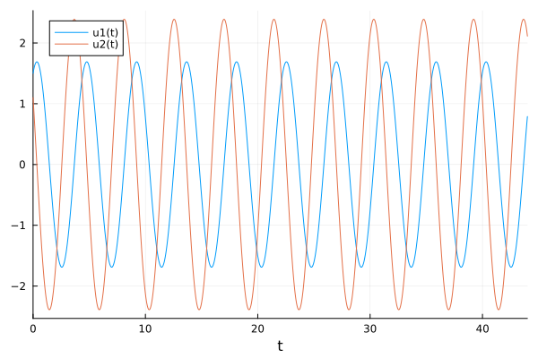{#fig:001 width=70%}

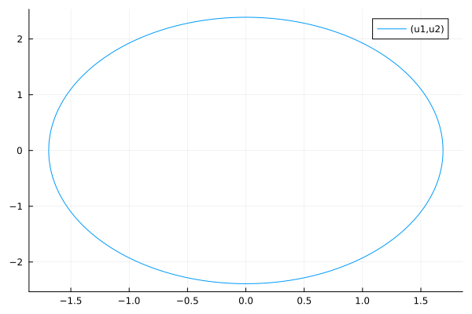{#fig:002 width=70%}

Код программы для второго случая:
```
ing DifferentialEquations
using Plots

function lorenz!(du, u, p, t)
	a, b = p
	du[1] = u[2]
	du[2] = -a*du[1] - b*u[1]
end

const x = 1.5
const y = 1.1
u0 = [x, y]

p = (3, 3)
tspan = (0.0, 44.0)
prob = ODEProblem(lorenz!, u0, tspan, p)
sol = solve(prob, dtmax = 0.05)

plot(sol)
savefig("lab4_2_juliasolve.png")

plot(sol, vars=(1,2))
savefig("lab4_2_juliaphase.png")
```
В результате работы программы получаем следующие графики: (рис. [-@fig:003]) (рис. [-@fig:004]).

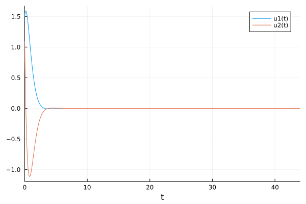{#fig:003 width=70%}

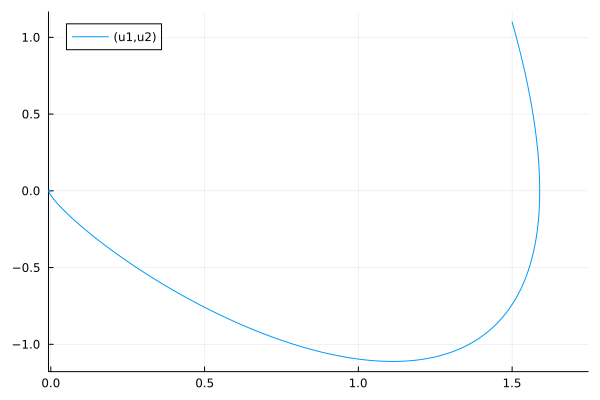{#fig:004 width=70%}

Код программы для третьего случая:
```
using DifferentialEquations
using Plots

function lorenz!(du, u, p, t)
	a, b = p
	du[1] = u[2]
	du[2] = -a*du[1] - b*u[1] + sin(4*t)
end

const x = 1.5
const y = 1.1
u0 = [x, y]

p = (4, 4)
tspan = (0.0, 44.0)
prob = ODEProblem(lorenz!, u0, tspan, p)
sol = solve(prob, dtmax = 0.05)

plot(sol)
savefig("lab4_3_juliasolve.png")

plot(sol, vars=(1,2))
savefig("lab4_3_juliaphase.png")
```
В результате работы программы получаем следующие графики: (рис. [-@fig:005]) (рис. [-@fig:006]).

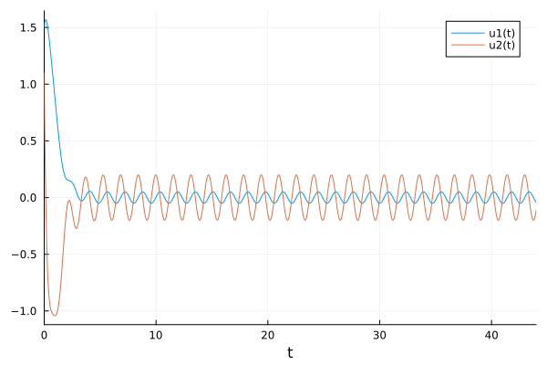{#fig:005 width=70%}

{#fig:006 width=70%}

### OpenModelica

Код программы для первого случая [1]:
```
model lab04_1

parameter Real w = 2;
parameter Real g = 0;
parameter Real x0 = 1.5;
parameter Real y0 = 1.1;

Real x(start=x0);
Real y(start=y0);

equation
der(x) = y;
der(y) = -w*x;
end lab04_1;
```

В результате работы программы получаем следующие графики: (рис. [-@fig:007]) (рис. [-@fig:008]).

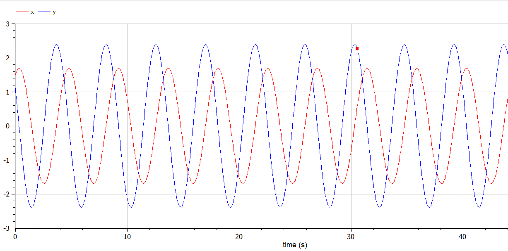{#fig:007 width=70%}

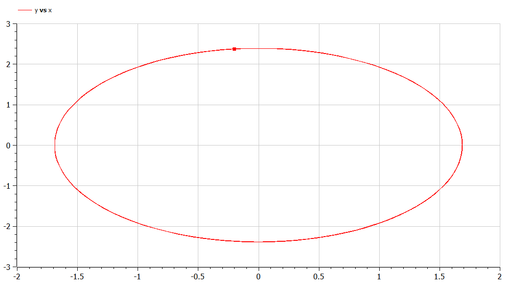{#fig:008 width=70%}

Код программы для второго случая:
```
model lab04_2
parameter Real w = 3;
parameter Real g = 3;
parameter Real x0 = 1.5;
parameter Real y0 = 1.1;

Real x(start=x0);
Real y(start=y0);

equation
der(x) = y;
der(y) = -w*x-g*y;
end lab04_2;
```

В результате работы программы получаем следующие графики: (рис. [-@fig:009]) (рис. [-@fig:010]).

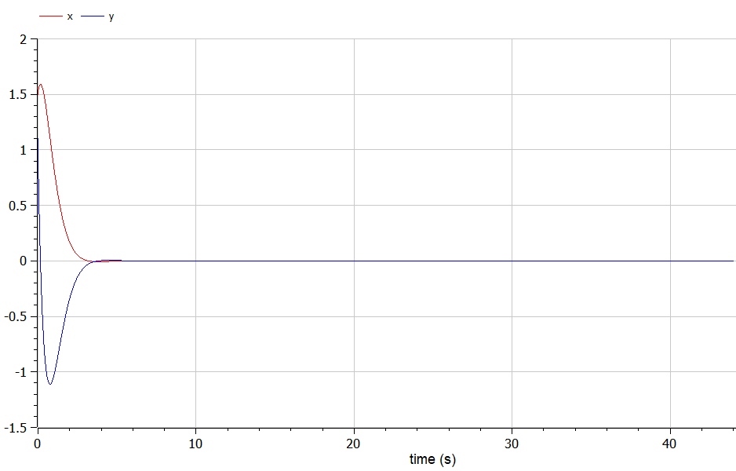{#fig:009 width=70%}

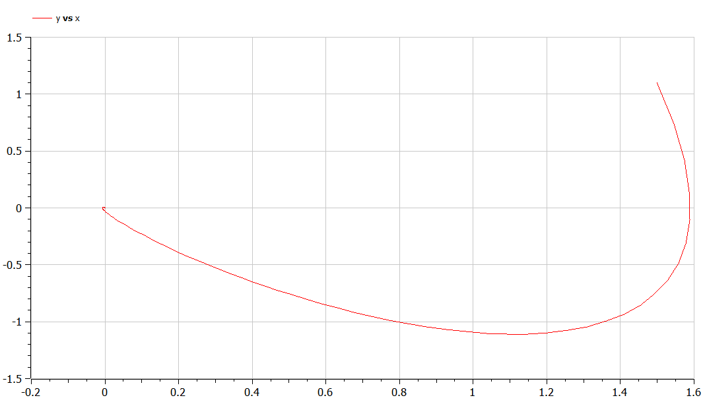{#fig:010 width=70%}

Код программы для третьего случая:
```
model lab04_3
parameter Real w = 4;
parameter Real g = 4;
parameter Real x0 = 1.5;
parameter Real y0 = 1.1;

Real x(start=x0);
Real y(start=y0);

equation
der(x) = y;
der(y) = -w*x-g*y+sin(4*time);
end lab04_3;
```

В результате работы программы получаем следующие графики: (рис. [-@fig:011]) (рис. [-@fig:012]).

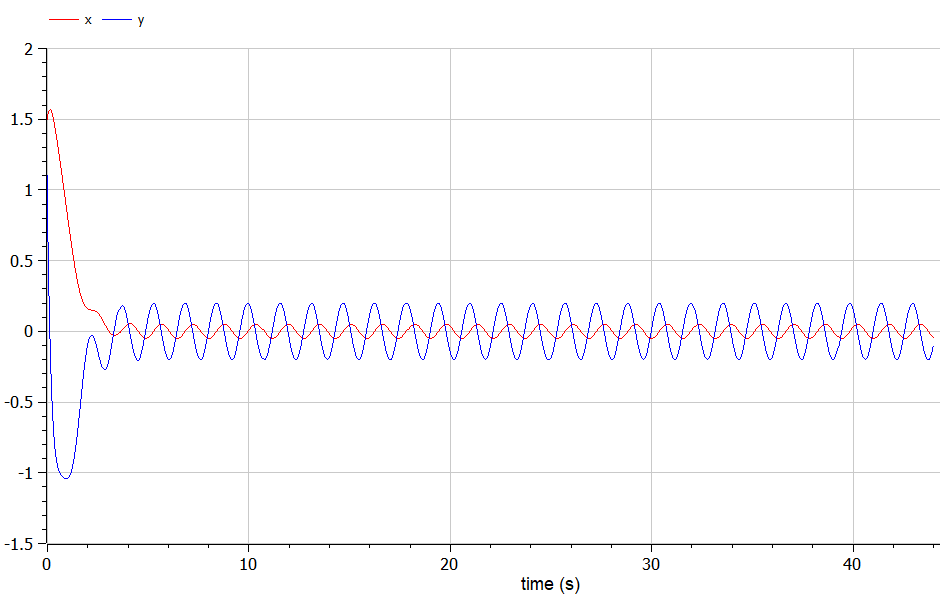{#fig:011 width=70%}

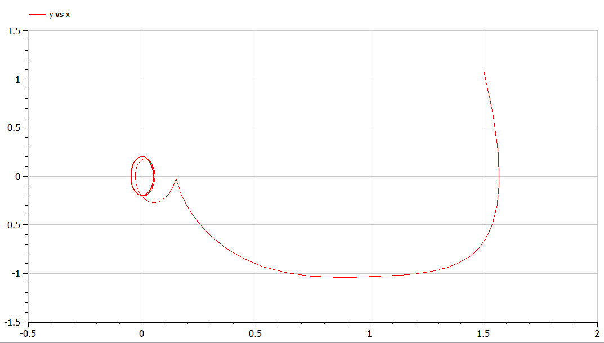{#fig:012 width=70%}

## Анализ

Графики в OpenModelica получились идентичными с графиками, полученными с помощью Julia. 

# Выводы

Ознакомились с понятием гармонического осциллятора. Построили фазовый портрет и решение уравнения гармонического осциллятора с помощью языков OpenModelica и Julia.

# Список литературы{.unnumbered}

[1] Документация по OpenModelica: https://openmodelica.org/

[2] Документация по Julia: https://docs.julialang.org/en/v1/
