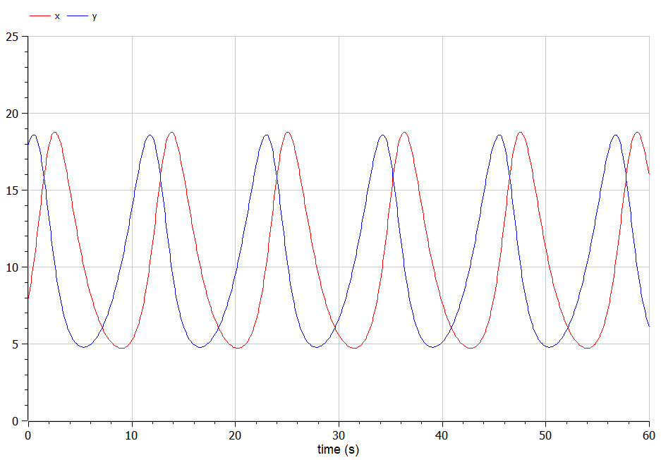
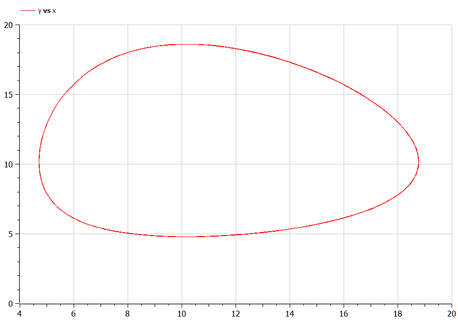
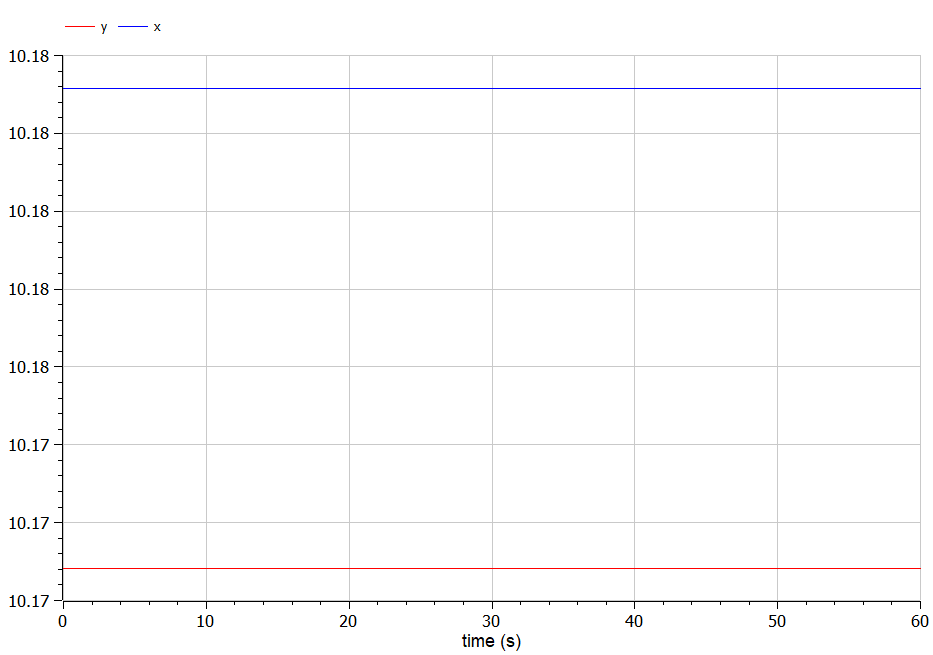
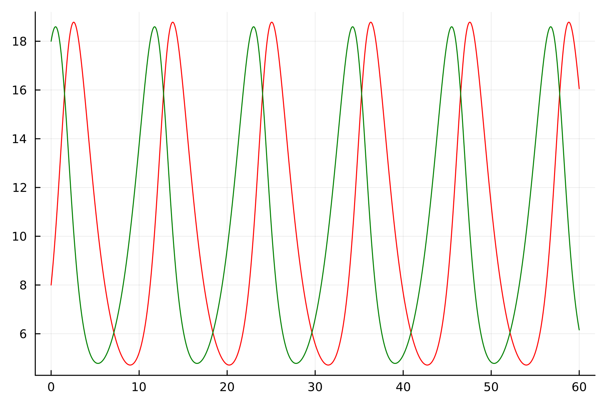
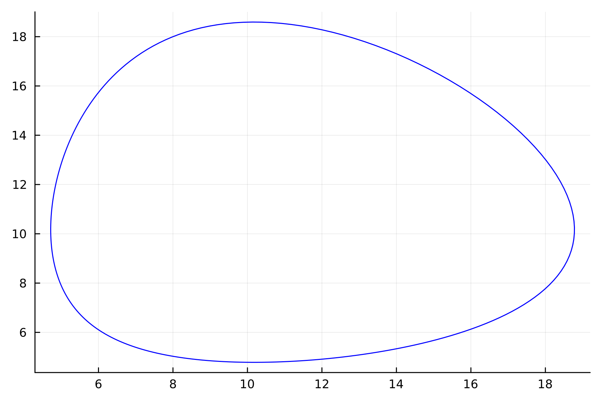
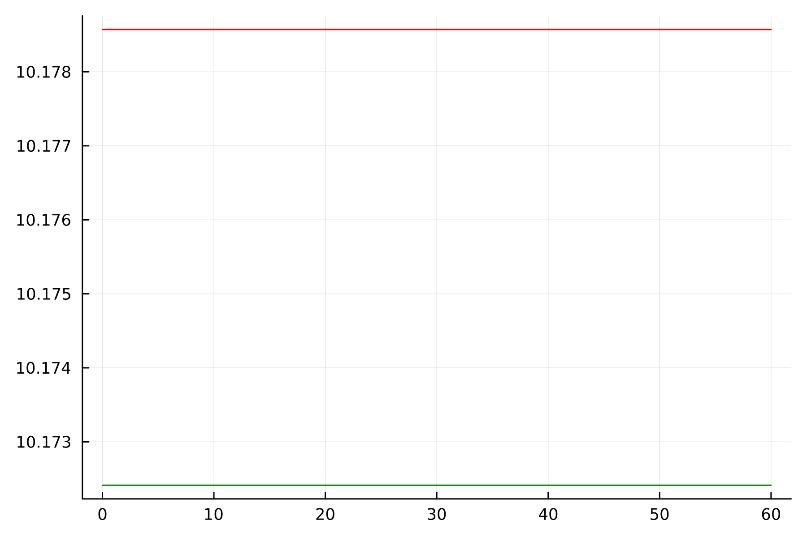

---
## Front matter
lang: ru-RU
title: Лабораторная работа №5
subtitle: Модель хищник-жертва
author:
  - Желдакова В. А.
institute:
  - Российский университет дружбы народов, Москва, Россия
date: 01 марта 2024

## i18n babel
babel-lang: russian
babel-otherlangs: english

## Formatting pdf
toc: false
toc-title: Содержание
slide_level: 2
aspectratio: 169
section-titles: true
theme: metropolis
header-includes:
 - \metroset{progressbar=frametitle,sectionpage=progressbar,numbering=fraction}
 - '\makeatletter'
 - '\beamer@ignorenonframefalse'
 - '\makeatother'
---

# Информация

## Докладчик

:::::::::::::: {.columns align=center}
::: {.column width="70%"}

  * Желдакова Виктория Алексеевна
  * студентка группы НФИбд-01-21
  * Российский университет дружбы народов

:::
::: {.column width="30%"}

:::
::::::::::::::

# Вводная часть

## Цель работы

Построить график зависимости численности хищников от численности жертв, графики изменения численности хищников и численности жертв и найти стационарное состояние системы с помощью языков OpenModelica и Julia.

## Задание

### Вариант 16

Для модели «хищник-жертва»:

$$\left\{ \begin{array}{cl}
{\frac{dx}{dt}=-0.59x(t)+0.058x(t)y(t)}\\
{\frac{dy}{dt}=0.57y(t)-0.056x(t)y(t)}
\end{array} \right. $$

Построёте график зависимости численности хищников от численности жертв,  а также графики изменения численности хищников и численности жертв при следующих начальных условиях: $x_0=8, y_0=18$. Найдите стационарное состояние системы.

# Ход работы

## Математическая модель

Простейшая модель взаимодействия двух видов типа «хищник — жертва» - модель Лотки-Вольтерры. Данная двувидовая модель основывается на следующих предположениях:

1. Численность популяции жертв x и хищников y зависят только от времени (модель не учитывает пространственное распределение популяции на занимаемой территории)
2. В отсутствии взаимодействия численность видов изменяется по модели Мальтуса, при этом число жертв увеличивается, а число хищников падает
3. Естественная смертность жертвы и естественная рождаемость хищника считаются несущественными
4. Эффект насыщения численности обеих популяций не учитывается
5. Скорость роста численности жертв уменьшается пропорционально численности хищников

## Математическая модель

$$\left\{ \begin{array}{cl}
{\frac{dx}{dt}=ax(t)-bx(t)y(t)}\\
{\frac{dy}{dt}=-cy(t)+dx(t)y(t)}
\end{array} \right. $$

В этой модели $x$ – число жертв, $y$ - число хищников. Коэффициент a описывает скорость естественного прироста числа жертв в отсутствие хищников, $с$ - естественное вымирание хищников, лишенных пищи в виде жертв. Вероятность взаимодействия жертвы и хищника считается пропорциональной как количеству жертв, так и числу самих хищников ($xy$). Каждый акт взаимодействия уменьшает популяцию жертв, но способствует увеличению популяции хищников (члены $-bxy$ и $dxy$ в правой части уравнения). 

## Математическая модель

Математический анализ этой (жесткой) модели показывает, что имеется стационарное состояние, всякое же другое начальное состояние (B) приводит к периодическому колебанию численности как жертв, так и хищников, так что по прошествии некоторого времени система возвращается в состояние B.

Стационарное состояние системы (1) (положение равновесия, не зависящееот времени решение) будет в точке: $x_0 = \frac{c}{d}, y_0 = \frac{a}{b}$. Если начальные значения задать в стационарном состоянии $x(0) = x_0, y(0) = y_0$, то в любой момент времени численность популяций изменяться не будет. При малом отклонении от положения равновесия численности как хищника, так и жертвы с течением времени не возвращаются к равновесным значениям, а совершают периодические колебания вокруг стационарной точки. Амплитуда колебаний и их период определяется начальными значениями численностей $x(0), y(0)$. Колебания совершаются в противофазе.

## Решение с помощью языков программирования

### OpenModelica

{#fig:001 width=70%}

## Решение с помощью языков программирования

{#fig:002 width=70%}

## Решение с помощью языков программирования

{#fig:003 width=70%}

## Решение с помощью языков программирования

### Julia

{#fig:004 width=70%}

## Решение с помощью языков программирования

{#fig:005 width=70%}

## Решение с помощью языков программирования

{#fig:006 width=70%}

## Анализ

Графики в OpenModelica получились идентичными с графиками, полученными с помощью Julia. 

# Выводы

Построили графики зависимости численности хищников от численности жертв, графики изменения численности хищников и численности жертв и нашли стационарное состояние систем с помощью языков OpenModelica и Julia.

