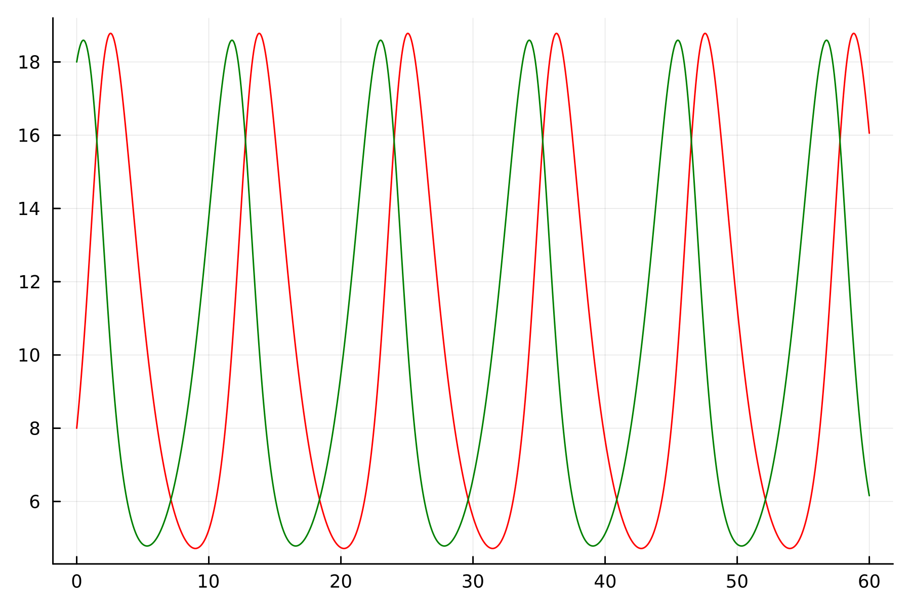
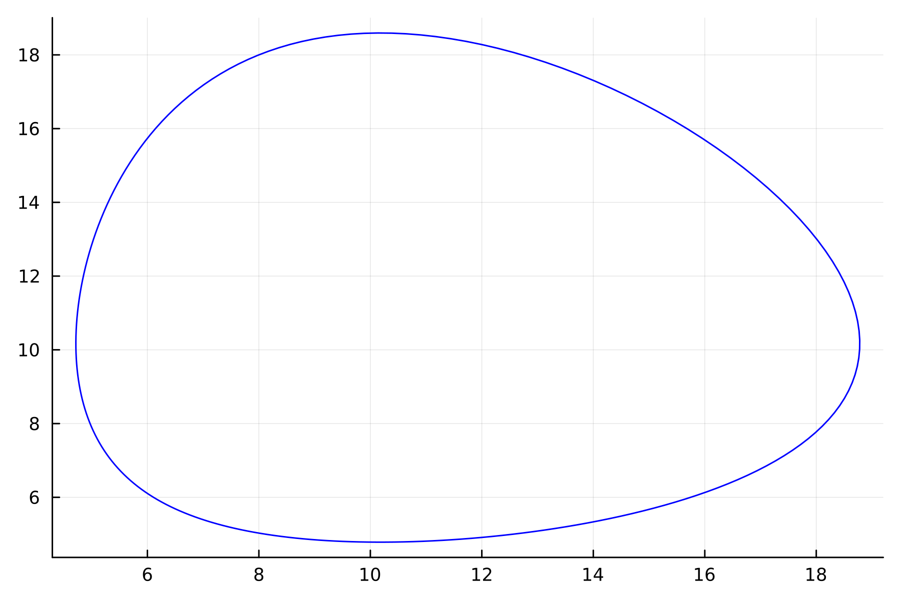
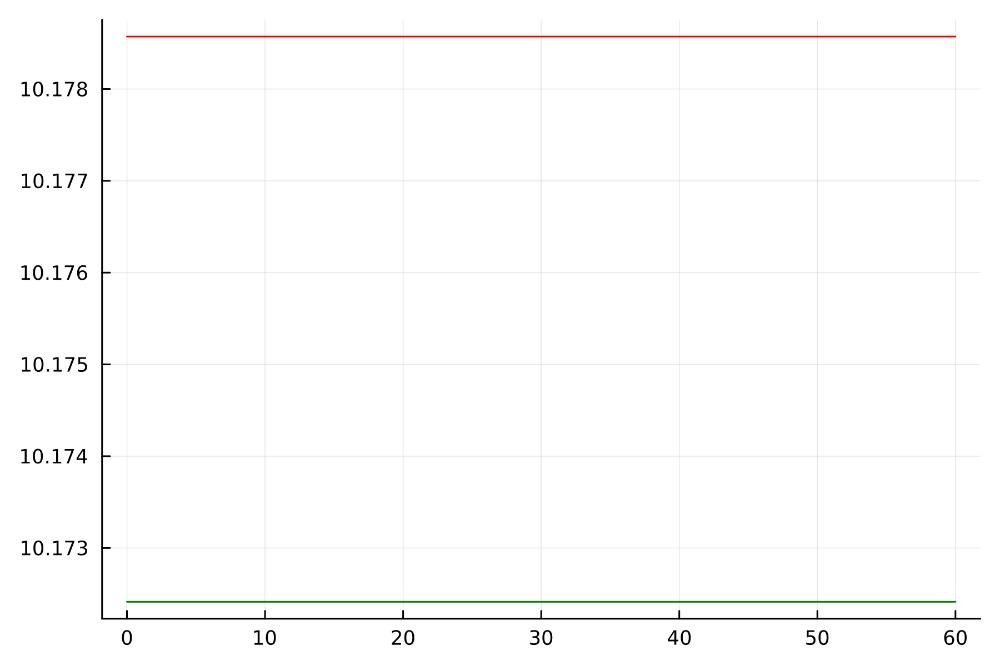
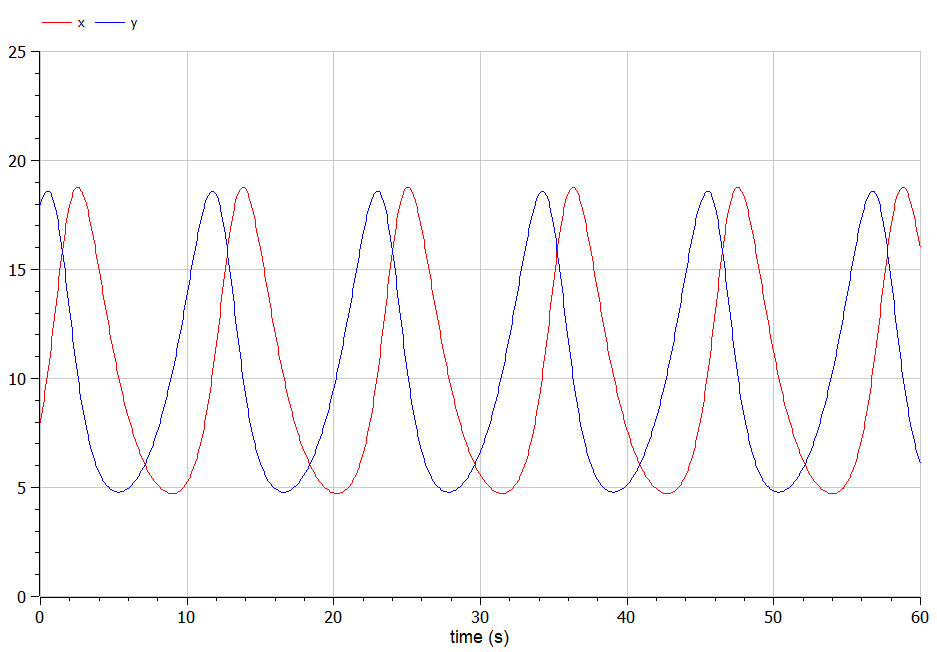
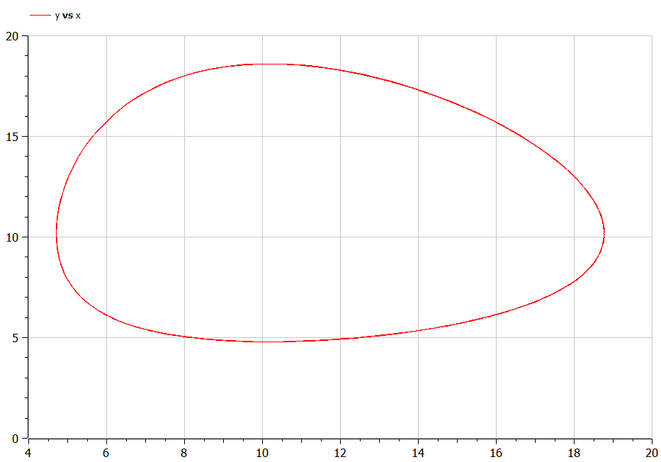
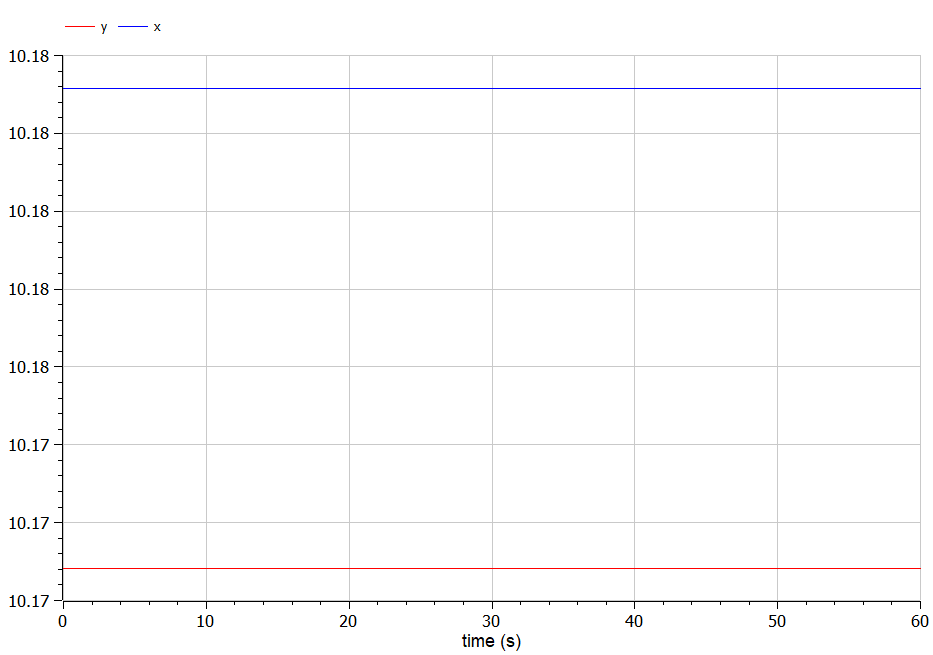

---
## Front matter
title: "Отчёт по лабораторной работе №5"
subtitle: "Модель хищник-жертва"
author: "Желдакова Виктория Алексеевна"

## Generic otions
lang: ru-RU
toc-title: "Содержание"

## Bibliography
bibliography: bib/cite.bib
csl: pandoc/csl/gost-r-7-0-5-2008-numeric.csl

## Pdf output format
toc: true # Table of contents
toc-depth: 2
lof: true # List of figures
lot: true # List of tables
fontsize: 12pt
linestretch: 1.5
papersize: a4
documentclass: scrreprt
## I18n polyglossia
polyglossia-lang:
  name: russian
  options:
	- spelling=modern
	- babelshorthands=true
polyglossia-otherlangs:
  name: english
## I18n babel
babel-lang: russian
babel-otherlangs: english
## Fonts
mainfont: PT Serif
romanfont: PT Serif
sansfont: PT Sans
monofont: PT Mono
mainfontoptions: Ligatures=TeX
romanfontoptions: Ligatures=TeX
sansfontoptions: Ligatures=TeX,Scale=MatchLowercase
monofontoptions: Scale=MatchLowercase,Scale=0.9
## Biblatex
biblatex: true
biblio-style: "gost-numeric"
biblatexoptions:
  - parentracker=true
  - backend=biber
  - hyperref=auto
  - language=auto
  - autolang=other*
  - citestyle=gost-numeric
## Pandoc-crossref LaTeX customization
figureTitle: "Рис."
tableTitle: "Таблица"
listingTitle: "Листинг"
lofTitle: "Список иллюстраций"
lotTitle: "Список таблиц"
lolTitle: "Листинги"
## Misc options
indent: true
header-includes:
  - \usepackage{indentfirst}
  - \usepackage{float} # keep figures where there are in the text
  - \floatplacement{figure}{H} # keep figures where there are in the text
---

# Цель работы

Построить график зависимости численности хищников от численности жертв, графики изменения численности хищников и численности жертв и найти стационарное состояние системы с помощью языков OpenModelica и Julia.

# Задание

## Вариант 16

Для модели «хищник-жертва»:

$$\left\{ \begin{array}{cl}
{\frac{dx}{dt}=-0.59x(t)+0.058x(t)y(t)}\\
{\frac{dy}{dt}=0.57y(t)-0.056x(t)y(t)}
\end{array} \right. $$

Построёте график зависимости численности хищников от численности жертв,  а также графики изменения численности хищников и численности жертв при следующих начальных условиях: $x_0=8, y_0=18$. Найдите стационарное состояние системы.

# Теоретическое введение

Простейшая модель взаимодействия двух видов типа «хищник — жертва» - модель Лотки-Вольтерры. Данная двувидовая модель основывается на следующих предположениях:
1. Численность популяции жертв x и хищников y зависят только от времени (модель не учитывает пространственное распределение популяции на занимаемой территории)
2. В отсутствии взаимодействия численность видов изменяется по модели Мальтуса, при этом число жертв увеличивается, а число хищников падает
3. Естественная смертность жертвы и естественная рождаемость хищника считаются несущественными
4. Эффект насыщения численности обеих популяций не учитывается
5. Скорость роста численности жертв уменьшается пропорционально численности хищников

$$\left\{ \begin{array}{cl}
{\frac{dx}{dt}=ax(t)-bx(t)y(t)}\\
{\frac{dy}{dt}=-cy(t)+dx(t)y(t)}
\end{array} \right. $$

В этой модели $x$ – число жертв, $y$ - число хищников. Коэффициент a описывает скорость естественного прироста числа жертв в отсутствие хищников, $с$ - естественное вымирание хищников, лишенных пищи в виде жертв. Вероятность взаимодействия жертвы и хищника считается пропорциональной как количеству жертв, так и числу самих хищников ($xy$). Каждый акт взаимодействия уменьшает популяцию жертв, но способствует увеличению популяции хищников (члены $-bxy$ и $dxy$ в правой части уравнения). 

Математический анализ этой (жесткой) модели показывает, что имеется стационарное состояние, всякое же другое начальное состояние (B) приводит к периодическому колебанию численности как жертв, так и хищников, так что по прошествии некоторого времени система возвращается в состояние B.

Стационарное состояние системы (1) (положение равновесия, не зависящееот времени решение) будет в точке: $x_0 = \frac{c}{d}, y_0 = \frac{a}{b}$. Если начальные значения задать в стационарном состоянии $x(0) = x_0, y(0) = y_0$, то в любой момент времени численность популяций изменяться не будет. При малом отклонении от положения равновесия численности как хищника, так и жертвы с течением времени не возвращаются к равновесным значениям, а совершают периодические колебания вокруг стационарной точки. Амплитуда колебаний и их период определяется начальными значениями численностей $x(0), y(0)$. Колебания совершаются в противофазе.

# Выполнение лабораторной работы

## Решение с помощью языков программирования

### Julia

Код программы для нестационарного случая [2]:
```
ing Plots
using DifferentialEquations

x0 = 8
y0 = 18

a = 0.59
b = 0.058
c = 0.57
d = 0.056

function ode_fn(du, u, p, t)
	x, y = u
	du[1] = -a*x + b*x*y 
	du[2] = c*y - d*x*y
end

v0 = [x0, y0]
tspan = (0.0, 60.0)
prob = ODEProblem(ode_fn, v0, tspan)
sol = solve(prob, dtmax=0.05)
X = [u[1] for u in sol.u]
Y = [u[2] for u in sol.u]
T = [t for t in sol.t]

plt = plot(dpi=300, legend=false)
plot!(plt, X, Y, color=:blue)

savefig(plt, "lab05_1.png") 

plt2 = plot(dpi=300, legend=false)
plot!(plt2, T, X, label="Численность жертв", color=:red)
plot!(plt2, T, Y, label="Численность хищников", color=:green)

savefig(plt2, "lab05_2.png") 
```

В результате работы программы получаем следующие графики: (рис. [-@fig:001]) (рис. [-@fig:002]).

{#fig:001 width=70%}

{#fig:002 width=70%}

Код программы для стационарного случая:
```
ing Plots
using DifferentialEquations

a = 0.59
b = 0.058
c = 0.57
d = 0.056

x0 = c/d
y0 = a/b

function ode_fn(du, u, p, t)
	x, y = u
	du[1] = -a*x + b*x*y 
	du[2] = c*y - d*x*y
end

v0 = [x0, y0]
tspan = (0.0, 60.0)
prob = ODEProblem(ode_fn, v0, tspan)
sol = solve(prob, dtmax=0.05)
X = [u[1] for u in sol.u]
Y = [u[2] for u in sol.u]
T = [t for t in sol.t]

plt2 = plot(dpi=300, legend=false)
plot!(plt2, T, X, label="Численность жертв", color=:red)
plot!(plt2, T, Y, label="Численность хищников", color=:green)

savefig(plt2, "lab05_3.png") 
```
В результате работы программы получаем следующий график: (рис. [-@fig:003]).

{#fig:003 width=70%}

### OpenModelica

Код программы для нестационарного случая [1]:
```
model lab05_1
Real a = 0.59;
Real b = 0.058;
Real c = 0.57;
Real d = 0.056;
Real x;
Real y;
initial equation
x = 8;
y = 18;
equation
der(x) = -a*x + b*x*y;
der(y) = c*y - d*x*y;
end lab05_1;
```

В результате работы программы получаем следующие графики: (рис. [-@fig:004]) (рис. [-@fig:005]).

{#fig:004 width=70%}

{#fig:005 width=70%}

Код программы для стационарного случая:
```
model lab05_2
Real a = 0.59;
Real b = 0.058;
Real c = 0.57;
Real d = 0.056;
Real x;
Real y;
initial equation
x = c/d;
y = a/b;
equation
der(x) = -a*x + b*x*y;
der(y) = c*y - d*x*y;
end lab05_2;
```

В результате работы программы получаем следующий график: (рис. [-@fig:006]).

{#fig:006 width=70%}

## Анализ

Графики в OpenModelica получились идентичными с графиками, полученными с помощью Julia. 

# Выводы

Построили графики зависимости численности хищников от численности жертв, графики изменения численности хищников и численности жертв и нашли стационарное состояние систем с помощью языков OpenModelica и Julia.

# Список литературы{.unnumbered}

[1] Документация по OpenModelica: https://openmodelica.org/

[2] Документация по Julia: https://docs.julialang.org/en/v1/
