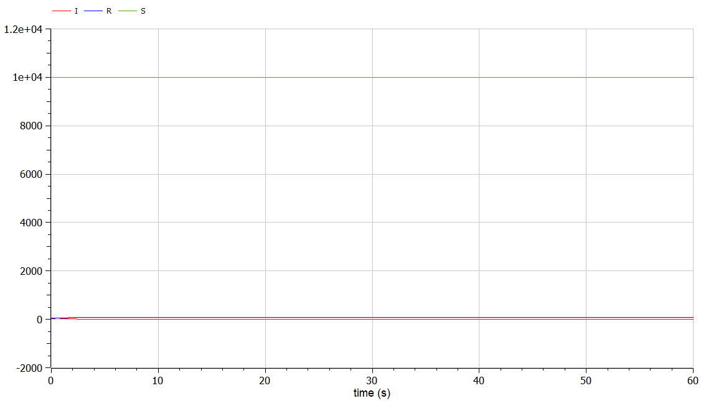
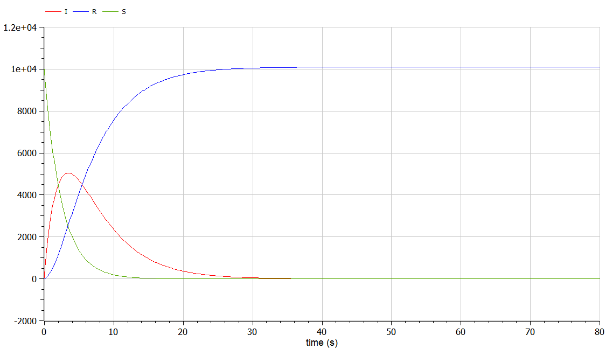
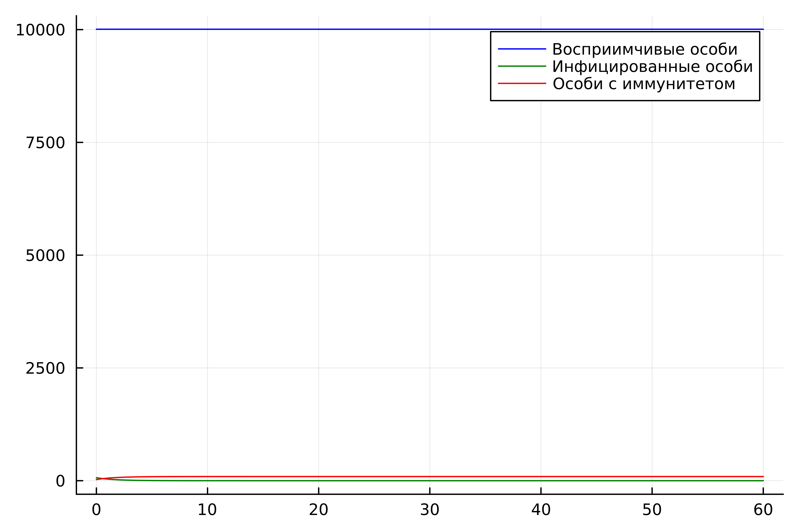
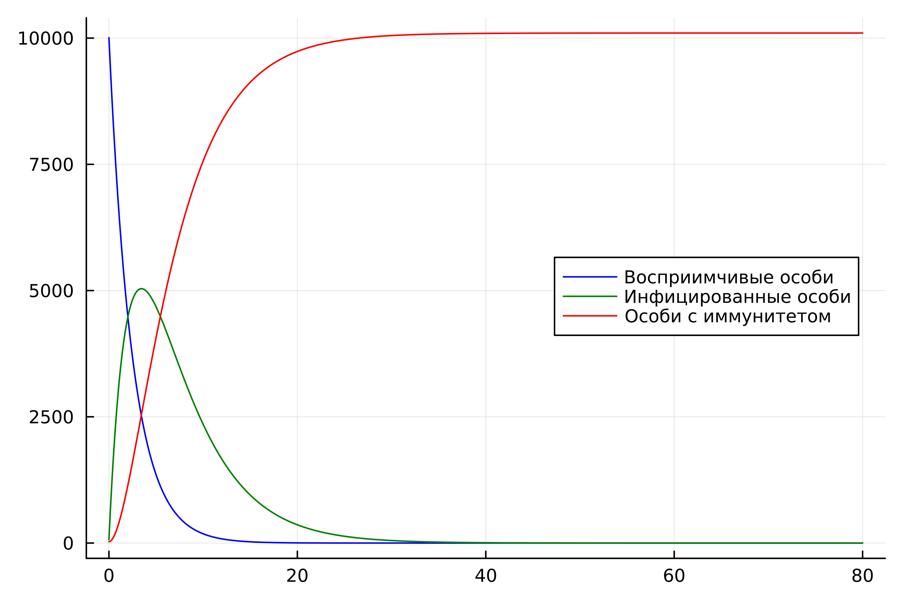

---
## Front matter
lang: ru-RU
title: Лабораторная работа №6
subtitle: Задача об эпидемии
author:
  - Желдакова В. А.
institute:
  - Российский университет дружбы народов, Москва, Россия
date: 01 марта 2024

## i18n babel
babel-lang: russian
babel-otherlangs: english

## Formatting pdf
toc: false
toc-title: Содержание
slide_level: 2
aspectratio: 169
section-titles: true
theme: metropolis
header-includes:
 - \metroset{progressbar=frametitle,sectionpage=progressbar,numbering=fraction}
 - '\makeatletter'
 - '\beamer@ignorenonframefalse'
 - '\makeatother'
---

# Информация

## Докладчик

:::::::::::::: {.columns align=center}
::: {.column width="70%"}

  * Желдакова Виктория Алексеевна
  * студентка группы НФИбд-01-21
  * Российский университет дружбы народов

:::
::: {.column width="30%"}

:::
::::::::::::::

# Вводная часть

## Цель работы

Изучить и построить модель эпидемии с помощью языков OpenModelica и Julia.

## Задание

### Вариант 16

На одном острове вспыхнула эпидемия. Известно, что из всех проживающих на острове $(N=10 100)$ в момент начала эпидемии $(t=0)$ число заболевших людей (являющихся распространителями инфекции) $I(0)=66$, А число здоровых людей с иммунитетом к болезни $R(0)=26$. Таким образом, число людей восприимчивых к болезни, но пока здоровых, в начальный момент времени $S(0)=N-I(0)- R(0)$.

Постройте графики изменения числа особей в каждой из трех групп. Рассмотрите, как будет протекать эпидемия в случае: 

1.	$I(0)\leq I^*$
2.	$I(0)>I^*$

# Ход работы

## Математическая модель

Рассмотрим простейшую модель эпидемии. Предположим, что некая популяция, состоящая из $N$ особей, (считаем, что популяция изолирована) подразделяется на три группы. Первая группа - это восприимчивые к болезни, но пока здоровые особи, обозначим их через $S(t)$. Вторая группа – это число инфицированных особей, которые также при этом являются распространителями инфекции, обозначим их $I(t)$. А третья группа, обозначающаяся через $R(t)$ – это здоровые особи с иммунитетом к болезни.

## Математическая модель

До того, как число заболевших не превышает критического значения $I^*$, считаем, что все больные изолированы и не заражают здоровых. Когда $I(0)>I^*$, тогда инфицирование способны заражать восприимчивых к болезни особей. Таким образом, скорость изменения числа $S(t)$ меняется по следующему закону:

$$
\frac{dS}{dt}=
 \begin{cases}
	-\alpha S &\text{,если $I(t) > I^*$}
	\\   
	0 &\text{,если $I(t) \leq I^*$}
 \end{cases}
$$

## Математическая модель

Поскольку каждая восприимчивая к болезни особь, которая, в конце концов, заболевает, сама становится инфекционной, то скорость изменения числа инфекционных особей представляет разность за единицу времени между заразившимися и теми, кто уже болеет и лечится, т.е.:

$$
\frac{dI}{dt}=
 \begin{cases}
	\alpha S -\beta I &\text{, если $I(t) > I^*$}
	\\   
	-\beta I &\text{, если $I(t) \leq I^*$}
 \end{cases}
$$

## Математическая модель

А скорость изменения выздоравливающих особей (при этом приобретающие иммунитет к болезни)

$$\frac{dR}{dt} = \beta I$$

Для того, чтобы решения соответствующих уравнений определялось однозначно, необходимо задать начальные условия. Считаем, что на начало эпидемии в момент времени $t=0$ нет особей с иммунитетом к болезни $R(0)=0$, а число инфицированных и восприимчивых к болезни особей $I(0)$ и $S(0)$ соответственно. Для анализа картины протекания эпидемии необходимо
рассмотреть два случая: $I(0)\leq I^*$ и $I(0)>I^*$

## Решение с помощью языков программирования

### OpenModelica
{#fig:001 width=70%}

## Решение с помощью языков программирования

{#fig:002 width=70%}

## Решение с помощью языков программирования

### Julia
{#fig:003 width=70%}

## Решение с помощью языков программирования

{#fig:004 width=70%}

## Анализ

Графики в OpenModelica получились идентичными с графиками, полученными с помощью Julia. 

# Выводы

Изучили и построили модель эпидемии с помощью языков OpenModelica и Julia.