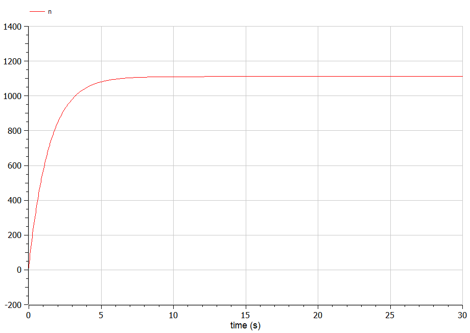
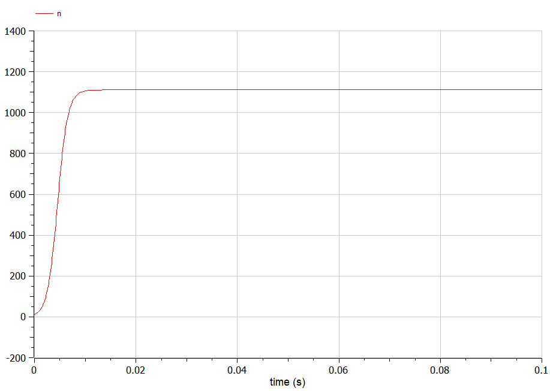
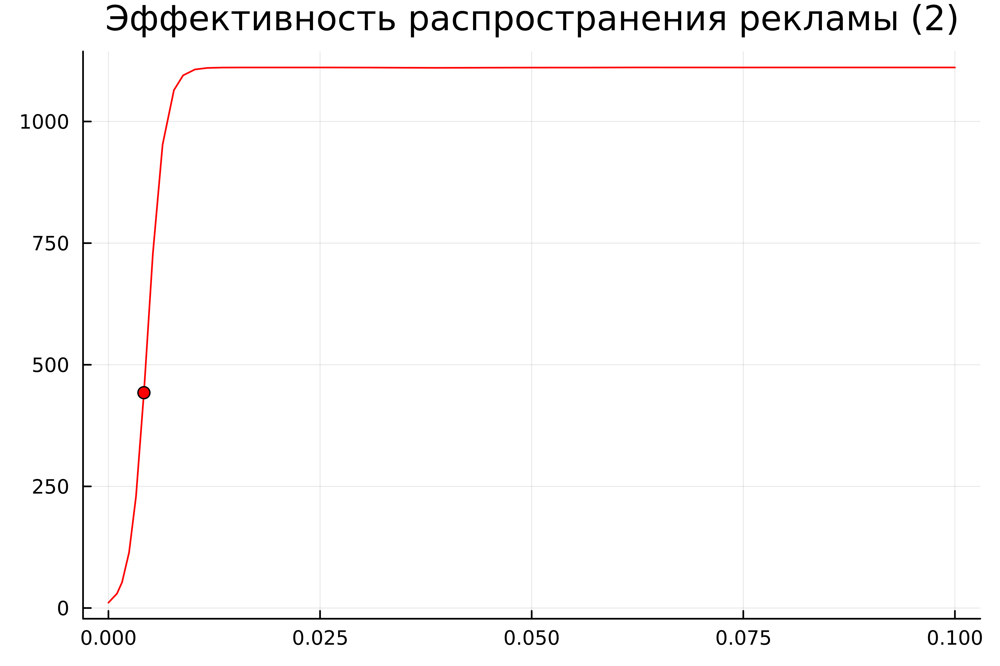
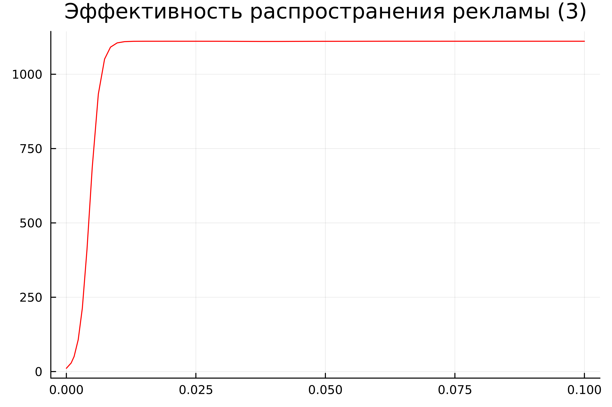

---
## Front matter
lang: ru-RU
title: Лабораторная работа №7
subtitle: Эффективность рекламы
author:
  - Желдакова В. А.
institute:
  - Российский университет дружбы народов, Москва, Россия
date: 04 марта 2024

## i18n babel
babel-lang: russian
babel-otherlangs: english

## Formatting pdf
toc: false
toc-title: Содержание
slide_level: 2
aspectratio: 169
section-titles: true
theme: metropolis
header-includes:
 - \metroset{progressbar=frametitle,sectionpage=progressbar,numbering=fraction}
 - '\makeatletter'
 - '\beamer@ignorenonframefalse'
 - '\makeatother'
---

# Информация

## Докладчик

:::::::::::::: {.columns align=center}
::: {.column width="70%"}

  * Желдакова Виктория Алексеевна
  * студентка группы НФИбд-01-21
  * Российский университет дружбы народов

:::
::: {.column width="30%"}

:::
::::::::::::::

# Вводная часть

## Цель работы

Ознакомиться с моделью эффективности рекламы и построить графики распространения рекламы с помощью языков OpenModelica и Julia.

## Задание

### Вариант 16

Постройте график распространения рекламы, математическая модель которой описывается следующим уравнением:

1. $\frac{dn}{dt} = (0.7 + 0.00002n(t))(N - n(t))$
2. $\frac{dn}{dt} = (0.00008 + 0.9n(t))(N - n(t))$
3. $\frac{dn}{dt} = (0.9cos(t) + 0.9cos(t)n(t))(N - n(t))$

При этом объем аудитории $N=1111$, в начальный момент о товаре знает 11 человек. Для случая 2 определите в какой момент времени скорость распространения рекламы будет иметь максимальное значение.

# Ход работы

## Математическая модель

Организуется рекламная кампания нового товара или услуги. Необходимо, чтобы прибыль будущих продаж с избытком покрывала издержки на рекламу. Вначале расходы могут превышать прибыль, поскольку лишь малая часть потенциальных покупателей будет информирована о новинке. Затем, при увеличении числа продаж, возрастает и прибыль, и, наконец, наступит момент, когда рынок насытиться, и рекламировать товар станет бесполезным.
Предположим, что торговыми учреждениями реализуется некоторая продукция, о которой в момент времени $t$ из числа потенциальных покупателей $N$ знает лишь $n$ покупателей. Для ускорения сбыта продукции запускается реклама по радио, телевидению и других средств массовой информации. После запуска рекламной кампании информация о продукции начнет распространяться среди потенциальных покупателей путем общения друг с другом. Таким образом, после запуска рекламных объявлений скорость изменения числа знающих о продукции людей пропорциональна как числу знающих о товаре покупателей, так и числу покупателей о нем не знающих.

## Математическая модель

Модель рекламной кампании описывается следующими величинами. Считаем, что $\frac{dn}{dt}$ - скорость изменения со временем числа потребителей, узнавших о товаре и готовых его купить, $t$ - время, прошедшее с начала рекламной кампании, n(t) - число уже информированных клиентов. Эта величина пропорциональна числу покупателей, еще не знающих о нем, это описывается следующим образом: $a_1(t)(N-n(t))$, где $N$ - общее число потенциальных платежеспособных покупателей, $a_1(t) > 0$ - характеризует интенсивность рекламной кампании (зависит от затрат на рекламу в данный момент времени). 

## Математическая модель

Помимо этого, узнавшие о товаре потребители также распространяют полученную информацию среди потенциальных покупателей, не знающих о нем (в этом случае работает т.н. сарафанное радио). Этот вклад в рекламу описывается величиной $a_2(t)n(t)(N-n(t))$, эта величина увеличивается с увеличением потребителей узнавших о товаре. Математическая модель распространения рекламы описывается уравнением:

 $\frac{dn}{dt} = (a_1(t) + a_2(t)n(t))(N - n(t))$

При $a_1(t) > a_2(t)$ получается модель типа модели Мальтуса. В обратном случае, получаем уравнение логистической кривой.

## Решение с помощью языков программирования

### OpenModelica

{#fig:001 width=70%}

## Решение с помощью языков программирования

{#fig:002 width=70%}

## Решение с помощью языков программирования

{#fig:003 width=70%}

## Решение с помощью языков программирования

### Julia

{#fig:004 width=70%}

## Решение с помощью языков программирования

{#fig:005 width=70%}

## Решение с помощью языков программирования

{#fig:006 width=70%}

## Анализ

Графики в OpenModelica получились идентичными с графиками, полученными с помощью Julia. 

# Выводы

Ознакомиться с моделью эффективность рекламы и построить графики распространения рекламы с помощью языков OpenModelica и Julia.
