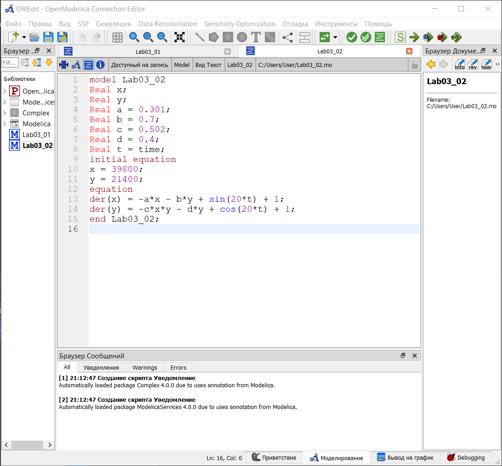

---
## Front matter
title: "Отчёт по лабораторной работе №7"
subtitle: "Эффективность рекламы"
author: "Желдакова Виктория Алексеевна"

## Generic otions
lang: ru-RU
toc-title: "Содержание"

## Bibliography
bibliography: bib/cite.bib
csl: pandoc/csl/gost-r-7-0-5-2008-numeric.csl

## Pdf output format
toc: true # Table of contents
toc-depth: 2
lof: true # List of figures
lot: true # List of tables
fontsize: 12pt
linestretch: 1.5
papersize: a4
documentclass: scrreprt
## I18n polyglossia
polyglossia-lang:
  name: russian
  options:
	- spelling=modern
	- babelshorthands=true
polyglossia-otherlangs:
  name: english
## I18n babel
babel-lang: russian
babel-otherlangs: english
## Fonts
mainfont: PT Serif
romanfont: PT Serif
sansfont: PT Sans
monofont: PT Mono
mainfontoptions: Ligatures=TeX
romanfontoptions: Ligatures=TeX
sansfontoptions: Ligatures=TeX,Scale=MatchLowercase
monofontoptions: Scale=MatchLowercase,Scale=0.9
## Biblatex
biblatex: true
biblio-style: "gost-numeric"
biblatexoptions:
  - parentracker=true
  - backend=biber
  - hyperref=auto
  - language=auto
  - autolang=other*
  - citestyle=gost-numeric
## Pandoc-crossref LaTeX customization
figureTitle: "Рис."
tableTitle: "Таблица"
listingTitle: "Листинг"
lofTitle: "Список иллюстраций"
lotTitle: "Список таблиц"
lolTitle: "Листинги"
## Misc options
indent: true
header-includes:
  - \usepackage{indentfirst}
  - \usepackage{float} # keep figures where there are in the text
  - \floatplacement{figure}{H} # keep figures where there are in the text
---

# Цель работы

Ознакомиться с моделью эффективности рекламы и построить графики распространения рекламы с помощью языков OpenModelica и Julia.

# Задание

## Вариант 16

Постройте график распространения рекламы, математическая модель которой описывается следующим уравнением:

1. $\frac{dn}{dt} = (0.7 + 0.00002n(t))(N - n(t))$
2. $\frac{dn}{dt} = (0.00008 + 0.9n(t))(N - n(t))$
3. $\frac{dn}{dt} = (0.9cos(t) + 0.9cos(t)n(t))(N - n(t))$

При этом объем аудитории $N=1111$, в начальный момент о товаре знает 11 человек. Для случая 2 определите в какой момент времени скорость распространения рекламы будет иметь максимальное значение.

# Теоретическое введение

Организуется рекламная кампания нового товара или услуги. Необходимо, чтобы прибыль будущих продаж с избытком покрывала издержки на рекламу. Вначале расходы могут превышать прибыль, поскольку лишь малая часть потенциальных покупателей будет информирована о новинке. Затем, при увеличении числа продаж, возрастает и прибыль, и, наконец, наступит момент, когда рынок насытиться, и рекламировать товар станет бесполезным.

Предположим, что торговыми учреждениями реализуется некоторая продукция, о которой в момент времени $t$ из числа потенциальных покупателей $N$ знает лишь $n$ покупателей. Для ускорения сбыта продукции запускается реклама по радио, телевидению и других средств массовой информации. После запуска рекламной кампании информация о продукции начнет распространяться среди потенциальных покупателей путем общения друг с другом. Таким образом, после запуска рекламных объявлений скорость изменения числа знающих о продукции людей пропорциональна как числу знающих о товаре покупателей, так и числу покупателей о нем не знающих.

Модель рекламной кампании описывается следующими величинами. Считаем, что $\frac{dn}{dt}$ - скорость изменения со временем числа потребителей, узнавших о товаре и готовых его купить, $t$ - время, прошедшее с начала рекламной кампании, n(t) - число уже информированных клиентов. Эта величина пропорциональна числу покупателей, еще не знающих о нем, это описывается следующим образом: $a_1(t)(N-n(t))$, где $N$ - общее число потенциальных платежеспособных покупателей, $a_1(t) > 0$ - характеризует интенсивность рекламной кампании (зависит от затрат на рекламу в данный момент времени). Помимо этого, узнавшие о товаре потребители также распространяют полученную информацию среди потенциальных покупателей, не знающих о нем (в этом случае работает т.н. сарафанное радио). Этот вклад в рекламу описывается величиной $a_2(t)n(t)(N-n(t))$, эта величина увеличивается с увеличением потребителей узнавших о товаре. Математическая модель распространения рекламы описывается уравнением:

 $\frac{dn}{dt} = (a_1(t) + a_2(t)n(t))(N - n(t))$

При $a_1(t) > a_2(t)$ получается модель типа модели Мальтуса. В обратном случае, получаем уравнение логистической кривой.

# Выполнение лабораторной работы

## Решение с помощью языков программирования

### Julia

Код программы для первого уравнения [2]:
```
using Plots
using DifferentialEquations

N = 1111
n0 = 11

function ode_fn(du, u, p, t)
	(n) = u
	du[1] = (0.7 + 0.00002*u[1])*(N - u[1])
end

v0 = [n0]
tspan = (0.0, 30.0)
prob = ODEProblem(ode_fn, v0, tspan)
sol = solve(prob, dtmax = 0.05)
n = [u[1] for u in sol.u]
T = [t for t in sol.t]

plt = plot(dpi = 600, title = "Эффективность распространения рекламы (1)", legend = false)
plot!(plt, T, n, color=:red)

savefig(plt, "lab07_1.png")
```

В результате работы программы получаем следующий график: (рис. [-@fig:001]).

{#fig:001 width=70%}

Код программы для второго уравнения:
```
using Plots
using DifferentialEquations

N = 1111
n0 = 11

function ode_fn(du, u, p, t)
	(n) = u
	du[1] = (0.00008 + 0.9*u[1])*(N - u[1])
end

v0 = [n0]
tspan = (0.0, 0.1)
prob = ODEProblem(ode_fn, v0, tspan)
sol = solve(prob, dtmax = 0.05)
n = [u[1] for u in sol.u]
T = [t for t in sol.t]

max_dn = 0;
max_dn_t = 0;
max_dn_n = 0;
for (i, t) in enumerate(T)
	if sol(t, Val{1})[1] > max_dn
		global max_dn = sol(t, Val{1})[1]
		global max_dn_t = t
		global max_dn_n = n[i]
	end
end

plt = plot(dpi = 600, title = "Эффективность распространения рекламы (2)", legend = false)
plot!(plt, T, n, color=:red)
plot!(plt, [max_dn_t], [max_dn_n], seriestype=:scatter, color=:red)

savefig(plt, "lab07_2.png")
```
В результате работы программы получаем следующий график: (рис. [-@fig:002]).

{#fig:002 width=70%}

Код программы для третьего уравнения:
```
using Plots
using DifferentialEquations

N = 1111
n0 = 11

function ode_fn(du, u, p, t)
	(n) = u
	du[1] = (0.9*cos(t) + 0.9*cos(t)*u[1])*(N - u[1])
end

v0 = [n0]
tspan = (0.0, 0.1)
prob = ODEProblem(ode_fn, v0, tspan)
sol = solve(prob, dtmax = 0.05)
n = [u[1] for u in sol.u]
T = [t for t in sol.t]

plt = plot(dpi = 600, title = "Эффективность распространения рекламы (3)", legend = false)
plot!(plt, T, n, color=:red)

savefig(plt, "lab07_3.png")
```
В результате работы программы получаем следующий график: (рис. [-@fig:003]).

{#fig:003 width=70%}

### OpenModelica

Код программы для первого уравнения [1]:
```
model lab07_1
Real N = 1111;
Real n;
initial equation
n = 11;
equation
der(n) = (0.7 + 0.00002*n)*(N-n);
end lab07_1;
```

В результате работы программы получаем следующий график: (рис. [-@fig:004]).

{#fig:004 width=70%}

Код программы для второго уравнения:
```
model lab07_2
Real N = 1111;
Real n; 
initial equation
n = 11;
equation
der(n) = (0.00008 + 0.9*n)*(N-n);
end lab07_2;
```

В результате работы программы получаем следующий график: (рис. [-@fig:005]).

{#fig:005 width=70%}

Код программы для третьего уравнения:
```
model lab07_3
Real N = 1111;
Real n; 
initial equation
n = 11;
equation
der(n) = (0.9*cos(time) + 0.9*cos(time)*n)*(N-n);
end lab07_3;
```

В результате работы программы получаем следующий график: (рис. [-@fig:006]).

{#fig:006 width=70%}

## Анализ

Графики в OpenModelica получились идентичными с графиками, полученными с помощью Julia. 

# Выводы

Ознакомиться с моделью эффективность рекламы и построить графики распространения рекламы с помощью языков OpenModelica и Julia.

# Список литературы{.unnumbered}

[1] Документация по OpenModelica: https://openmodelica.org/

[2] Документация по Julia: https://docs.julialang.org/en/v1/
