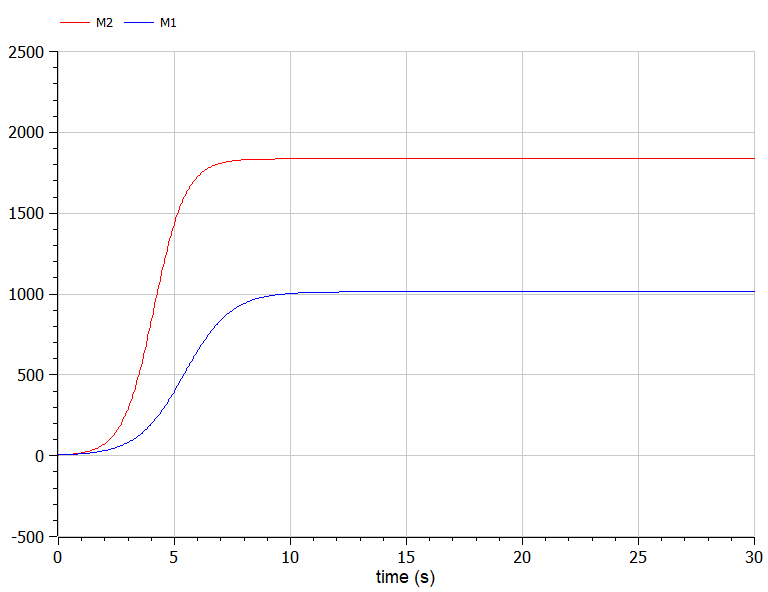
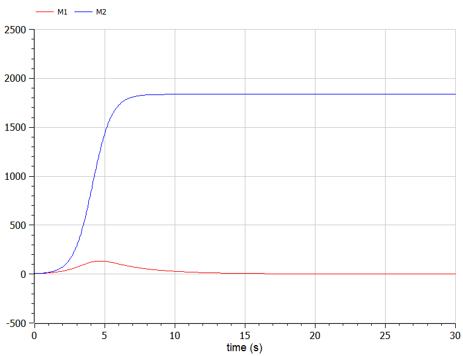
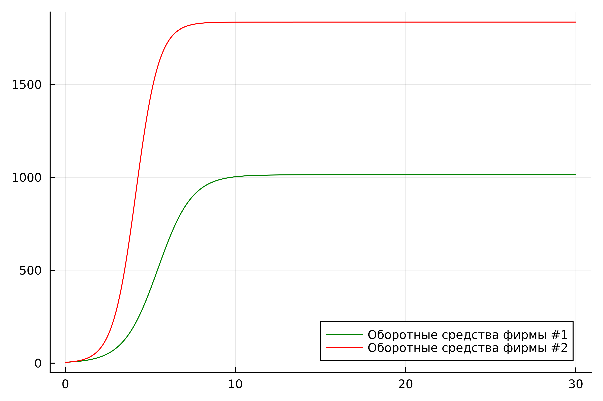
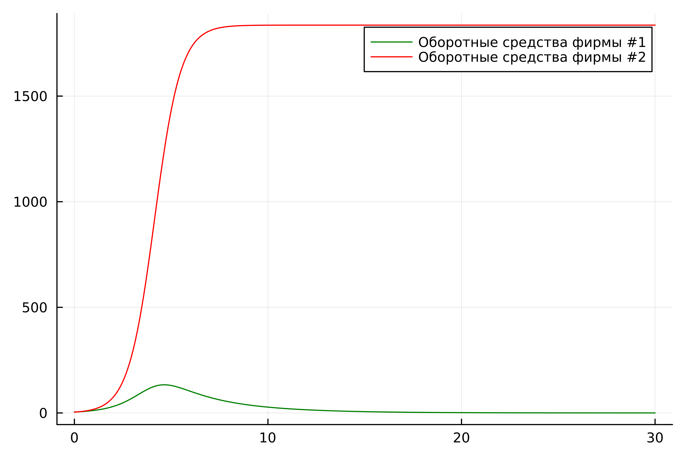

---
## Front matter
title: "Отчёт по лабораторной работе №8"
subtitle: "Модель конкуренции двух фирм"
author: "Желдакова Виктория Алексеевна"

## Generic otions
lang: ru-RU
toc-title: "Содержание"

## Bibliography
bibliography: bib/cite.bib
csl: pandoc/csl/gost-r-7-0-5-2008-numeric.csl

## Pdf output format
toc: true # Table of contents
toc-depth: 2
lof: true # List of figures
lot: true # List of tables
fontsize: 12pt
linestretch: 1.5
papersize: a4
documentclass: scrreprt
## I18n polyglossia
polyglossia-lang:
  name: russian
  options:
	- spelling=modern
	- babelshorthands=true
polyglossia-otherlangs:
  name: english
## I18n babel
babel-lang: russian
babel-otherlangs: english
## Fonts
mainfont: PT Serif
romanfont: PT Serif
sansfont: PT Sans
monofont: PT Mono
mainfontoptions: Ligatures=TeX
romanfontoptions: Ligatures=TeX
sansfontoptions: Ligatures=TeX,Scale=MatchLowercase
monofontoptions: Scale=MatchLowercase,Scale=0.9
## Biblatex
biblatex: true
biblio-style: "gost-numeric"
biblatexoptions:
  - parentracker=true
  - backend=biber
  - hyperref=auto
  - language=auto
  - autolang=other*
  - citestyle=gost-numeric
## Pandoc-crossref LaTeX customization
figureTitle: "Рис."
tableTitle: "Таблица"
listingTitle: "Листинг"
lofTitle: "Список иллюстраций"
lotTitle: "Список таблиц"
lolTitle: "Листинги"
## Misc options
indent: true
header-includes:
  - \usepackage{indentfirst}
  - \usepackage{float} # keep figures where there are in the text
  - \floatplacement{figure}{H} # keep figures where there are in the text
---

# Цель работы

Изучить и построить модель конкуренции двух фирм.

# Задание

## Вариант 16

Случай 1. Рассмотрим две фирмы, производящие взаимозаменяемые товары одинакового качества и находящиеся в одной рыночной нише. Считаем, что в рамках нашей модели конкурентная борьба ведётся только рыночными методами. То есть, конкуренты могут влиять на противника путем изменения параметров своего производства: себестоимость, время цикла, но не могут прямо вмешиваться в ситуацию на рынке («назначать» цену или влиять на потребителей каким-либо иным способом.) Будем считать, что постоянные издержки пренебрежимо малы, и в модели учитывать не будем. В этом случае динамика изменения объемов продаж фирмы 1 и фирмы 2 описывается следующей системой уравнений:

$$\frac{dM_1}{d\Theta} = M_1 - \frac{b}{c_1}M_1 M_2 - \frac{a1}{c1} M_1^2 $$

$$ \frac{dM_2}{d\Theta} = \frac{c_2}{c_1} M_2 - \frac{b}{c_1} M_1 M_2 - \frac{a_2}{c_1} M_2^2$$

где 
$$ a_1 = \frac{p_{cr}}{\tau_1^2 \widetilde{p}_1^2 Nq } $$
$$ a_2 = \frac{p_{cr}}{\tau_2^2 \widetilde{p}_2^2 Nq } $$ 
$$ b = \frac{p_{cr}}{\tau_1^2 \widetilde{p}_1^2 \tau_2^2 \widetilde{p}_2^2 Nq} $$
$$ c_1 = \frac{p_{cr} - \widetilde{p}_1}{\tau_1 \widetilde{p}_1} $$
$$ c_2 = \frac{p_{cr} - \widetilde{p}_2}{\tau_2 \widetilde{p}_2} $$

Также введена нормировка $t=c_1\theta$

Случай 2. Рассмотрим модель, когда, помимо экономического фактора влияния (изменение себестоимости, производственного цикла, использование кредита и т.п.), используются еще и социально-психологические факторы – формирование общественного предпочтения одного товара другому, не зависимо от их качества и цены. В этом случае взаимодействие двух фирм будет зависеть друг от друга, соответственно коэффициент перед $M_1 M_2$ будет отличаться. Пусть в рамках рассматриваемой модели динамика изменения объемов продаж фирмы 1 и фирмы 2 описывается следующей системой уравнений:

$$\frac{dM_1}{d\Theta} = M_1 - (\frac{b}{c_1} + 0.0007)M_1 M_2 - \frac{a1}{c1} M_1^2 $$

$$ \frac{dM_2}{d\Theta} = \frac{c_2}{c_1} M_2 - \frac{b}{c_1} M_1 M_2 - \frac{a_2}{c_1} M_2^2$$

Для обоих случаев рассмотрим задачу со следующими начальными условиями и параметрами: $$ M_0^1=4.4 \: M_0^2=4 $$
$$ p_{cr}=10.5 \: N=28 \: q=1 $$
$$ \tau_1=16 \: \tau_2=25 $$
$$ \widetilde{p}_1=7.2 \: \widetilde{p}_2=5.1 $$

1. Постройте графики изменения оборотных средств фирмы 1 и фирмы 2 без учета постоянных издержек и с веденной нормировкой для случая 1.
2. Постройте графики изменения оборотных средств фирмы 1 и фирмы 2 без учета постоянных издержек и с веденной нормировкой для случая 2.

# Выполнение лабораторной работы

## Математическая модель

Для построения модели конкуренции хотя бы двух фирм необходимо рассмотреть модель одной фирмы. Вначале рассмотрим модель фирмы, производящей продукт долговременного пользования, когда цена его определяется балансом спроса и предложения. Примем, что этот продукт занимает определенную нишу рынка и конкуренты в ней отсутствуют.

Обозначим:

$N$ – число потребителей производимого продукта.

$S$ – доходы потребителей данного продукта. Считаем, что доходы всех потребителей одинаковы. Это предположение справедливо, если речь идет об одной рыночной нише, т.е. производимый продукт ориентирован на определенный слой населения.

$M$ – оборотные средства предприятия.

$\tau$ – длительность производственного цикла.

$p$ – рыночная цена товара.

$\widetilde{p}$ – себестоимость продукта, то есть переменные издержки на производство единицы продукции.

$\delta$ – доля оборотных средств, идущая на покрытие переменных издержек.

$κ$ – постоянные издержки, которые не зависят от количества выпускаемой продукции.

$Q(S/p)$ – функция спроса, зависящая от отношения дохода S к цене p. Она равна количеству продукта, потребляемого одним потребителем в единицу
времени.

Функцию спроса товаров долговременного использования часто
представляют в простейшей форме:

$$Q = q - k\frac{p}{S} = q(1 - \frac{p}{p_{cr}})$$

где $q$ – максимальная потребность одного человека в продукте в единицу времени. Эта функция падает с ростом цены и при $p = p_{cr}$ (критическая стоимость продукта) потребители отказываются от приобретения товара. Величина $pcr = Sq/k$. Параметр $k$ – мера эластичности функции спроса по цене. Таким образом, функция спроса в форме (1) является пороговой (то есть, $Q(S/p) = 0$ при $p ≥ pcr$) и обладает свойствами насыщения.

Уравнения динамики оборотных средств можно записать в виде

$$\frac{dM}{dt} = -\frac{M \delta}{\tau} + NQp - k = -\frac{M\delta}{\tau} + Nq(1 - \frac{p}{p_{cr}})p - k$$

Уравнение для рыночной цены $p$ представим в виде

$$\frac{dp}{dt} = \gamma (-\frac{M\delta}{\tau \widetilde{p}} + Nq(1-\frac{p}{p_{cr}}) )$$

Первый член соответствует количеству поставляемого на рынок товара (то есть, предложению), а второй член – спросу.

Параметр $\gamma$ зависит от скорости оборота товаров на рынке. Как правило, время торгового оборота существенно меньше времени производственного цикла τ. При заданном $M$ уравнение (3) описывает быстрое стремление цены к равновесному значению цены, которое устойчиво.

В этом случае уравнение (3) можно заменить алгебраическим соотношением

$$ -\frac{M\delta}{\tau \widetilde{p}} + Nq(1-\frac{p}{p_{cr}}) = 0$$

Из (4) следует, что равновесное значение цены p равно

$$ p = p_{cr}(1 - \frac{M\delta}{\tau \widetilde{p} Nq})$$

Уравнение (2) с учетом (5) приобретает вид 

$$\frac{dM}{dt} = -\frac{M \delta}{\tau}(\frac{p}{p_{cr}}-1) - M^2 ( \frac{\delta}{\tau \widetilde{p} })^2 \frac{p_{cr}}{Nq} - k$$

Уравнение (6) имеет два стационарных решения, соответствующих
условию $\frac{dM}{dt} = 0$:

$$ \widetilde{M_{1,2}} = \frac{1}{2} a \pm \sqrt{\frac{a^2}{4} - b}$$

где

$$ a = Nq(1 - \frac{\widetilde{p}}{p_{cr}} \widetilde{p} \frac{\tau}{\delta}), b = kNq \frac{(\tau \widetilde{p})^2}{p_{cr}\delta ^2} $$

Из (7) следует, что при больших постоянных издержках (в случае $a^2 < 4b$) стационарных состояний нет. Это означает, что в этих условиях фирма не может функционировать стабильно, то есть, терпит банкротство. Однако, как правило, постоянные затраты малы по сравнению с переменными (то есть, $b << a^2$) и играютроль, только в случае, когда оборотные средства малы. При $b << a$ стационарные значения $M$ равны

$$ \widetilde{M_{+}} = Nq \frac{\tau}{\delta}(1 - \frac{\widetilde{p}}{p_{cr}})\widetilde{p}, \widetilde{M_{-}} = k\widetilde{p} \frac{\tau}{\delta(p_{cr} - \widetilde{p})} $$

Первое состояние $\widetilde{M_{+}}$ устойчиво и соответствует стабильному функционированию предприятия. Второе состояние $\widetilde{M_{-}}$ неустойчиво, так, что при $M < \widetilde{M_{-}}$ оборотные средства падают ($\frac{dM}{dt}< 0$), то есть, фирма идет к банкротству. По смыслу $\widetilde{M_{-}}$ соответствует начальному капиталу, необходимому для входа в рынок. 

В обсуждаемой модели параметр $\delta$ всюду входит в сочетании с $\tau$. Это значит, что уменьшение доли оборотных средств, вкладываемых в производство, эквивалентно удлинению производственного цикла. Поэтому мы в дальнейшем положим: $\delta = 1$, а параметр $\tau$ будем считать временем цикла, с учётом сказанного.

## Решение с помощью языков программирования

### OpenModelica

Код программы для первого случая [1]:

```
model lab08_1
Real cr = 10.5;
Real N = 28;
Real q = 1;
Real t1 = 16;
Real t2 = 25;
Real p1 = 7.2;
Real p2 = 5.1;

Real a1 = cr / (t1 * t1 * p1 * p1 * N * q);
Real a2 = cr / (t2 * t2 * p2 * p2 * N * q);
Real b = cr / (t1 * t1 * p1 * p1 * t2 * t2 * p2 * p2 * N * q);
Real c1 = (cr - p1) / (t1*p1);
Real c2 = (cr - p2) / (t2*p2);

Real M1;
Real M2;
initial equation
M1 = 4.4;
M2 = 4;
equation
der(M1) = M1 - b / c1 * M1 * M2 - a1 / c1 * M1 * M1;
der(M2) = c2 / c1 * M2 - b / c1 * M1 * M2 - a2 / c1 * M2 * M2;
end lab08_1;
```

В результате работы программы получаем следующий график (рис. [-@fig:001]).

{#fig:001 width=70%}

Код программы для второго случая:

```
model lab08_2
Real cr = 10.5;
Real N = 28;
Real q = 1;
Real t1 = 16;
Real t2 = 25;
Real p1 = 7.2;
Real p2 = 5.1;

Real a1 = cr / (t1 * t1 * p1 * p1 * N * q);
Real a2 = cr / (t2 * t2 * p2 * p2 * N * q);
Real b = cr / (t1 * t1 * p1 * p1 * t2 * t2 * p2 * p2 * N * q);
Real c1 = (cr - p1) / (t1*p1);
Real c2 = (cr - p2) / (t2*p2);

Real M1;
Real M2;
initial equation
M1 = 4.4;
M2 = 4;
equation
der(M1) = M1 - (b / c1 + 0.0007) * M1 * M2 - a1 / c1 * M1 * M1;
der(M2) = c2 / c1 * M2 - b / c1 * M1 * M2 - a2 / c1 * M2 * M2;
end lab08_2;
```

В результате работы программы получаем следующий график (рис. [-@fig:002]).

{#fig:002 width=70%}

### Julia

Код программы для первого случая [2]:

```
using Plots
using DifferentialEquations

cr = 10.5
N = 28
q = 1
t1 = 16
t2 = 25
p1 = 7.2
p2 = 5.1

a1 = cr / (t1 * t1 * p1 * p1 * N * q)
a2 = cr / (t2 * t2 * p2 * p2 * N * q)
b = cr / (t1 * t1 * p1 * p1 * t2 * t2 * p2 * p2 * N * q)
c1 = (cr - p1) / (t1*p1)
c2 = (cr - p2) / (t2*p2)

function ode_fn(du, u, p, t)
	M1, M2 = u
	du[1] = u[1] - b / c1 * u[1] * u[2] - a1 / c1*u[1] * u[1]
	du[2] = c2 / c1 * u[2] - b / c1 * u[1] * u[2] - a2 / c1 * u[2] * u[2]
end

v0 = [4.4, 4]
tspan = (0.0, 30.0)
prob = ODEProblem(ode_fn, v0, tspan)
sol = solve(prob, dtmax = 0.05)
M1 = [u[1] for u in sol.u]
M2 = [u[2] for u in sol.u]
T = [t for t in sol.t]

plt = plot(dpi = 600, legent = true)

plot!(plt, T, M1, label = "Оборотные средства фирмы #1", color = :green)
plot!(plt, T, M2, label = "Оборотные средства фирмы #2", color = :red)

savefig(plt, "lab08_1.png")
```

В результате работы программы получаем следующий график  (рис. [-@fig:003]).

{#fig:003 width=70%}

Код программы для первого случая:

```
using Plots
using DifferentialEquations

cr = 10.5
N = 28
q = 1
t1 = 16
t2 = 25
p1 = 7.2
p2 = 5.1

a1 = cr / (t1 * t1 * p1 * p1 * N * q)
a2 = cr / (t2 * t2 * p2 * p2 * N * q)
b = cr / (t1 * t1 * p1 * p1 * t2 * t2 * p2 * p2 * N * q)
c1 = (cr - p1) / (t1*p1)
c2 = (cr - p2) / (t2*p2)

function ode_fn(du, u, p, t)
	M1, M2 = u
	du[1] = u[1] - (b / c1 + 0.0007) * u[1] * u[2] - a1 / c1 * u[1] * u[1]
	du[2] = c2 / c1 * u[2] - b / c1 * u[1] * u[2] - a2 / c1 * u[2] * u[2]
end

v0 = [4.4, 4]
tspan = (0.0, 30.0)
prob = ODEProblem(ode_fn, v0, tspan)
sol = solve(prob, dtmax = 0.05)
M1 = [u[1] for u in sol.u]
M2 = [u[2] for u in sol.u]
T = [t for t in sol.t]

plt = plot(dpi = 600, legend = :topright)

plot!(plt, T, M1, label = "Оборотные средства фирмы #1", color = :green)
plot!(plt, T, M2, label = "Оборотные средства фирмы #2", color = :red)

savefig(plt, "lab08_2.png")
```
В результате работы программы получаем следующий график  (рис. [-@fig:004]).

{#fig:004 width=70%}

## Анализ

Графики в OpenModelica получились идентичными с графиками, полученными с помощью Julia. 

# Выводы

Изучили и построили модель конкуренции двух фирм.

# Список литературы{.unnumbered}

[1] Документация по OpenModelica: https://openmodelica.org/

[2] Документация по Julia: https://docs.julialang.org/en/v1/
